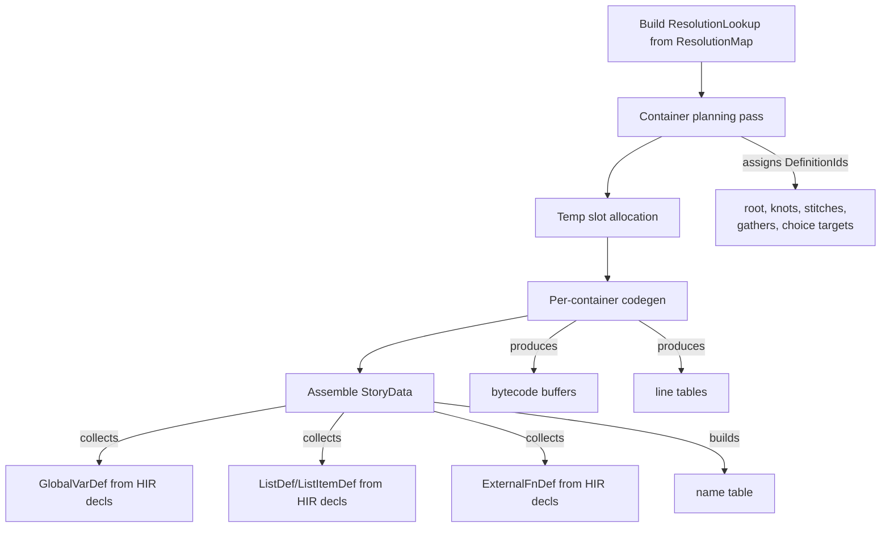

# Codegen gap analysis: HIR + Analyzer → StoryData

**Date:** 2026-03-06

Analysis of what's needed to get from the current state (passes 1–5) to producing `StoryData` (pass 6). Covers gaps in the analyzer, missing LIR/codegen infrastructure, and a recommended approach.

## Current state

- **Pass 1–2 (parse + HIR lowering):** Fully functional. Produces `HirFile`, `SymbolManifest`, diagnostics per file.
- **Pass 3 (merge + resolve):** Working. Produces `SymbolIndex` + `ResolutionMap`.
- **Pass 4–5 (type check + validate):** Not implemented. Stubs only.
- **Pass 6 (codegen):** Stub — returns empty `StoryData`.

## Recent changes (2026-03-06)

Commit `34ad6d9` refactored `FileId` threading and `Diagnostic` ownership:

- **`Diagnostic.file` is now non-optional (`FileId`, not `Option<FileId>`).** Every diagnostic is tagged with its source file at creation time.
- **Lowering functions take `FileId` as first parameter.** `lower(file_id, file)`, `lower_knot(file_id, knot)`, `lower_top_level(file_id, file)` — the `LowerCtx` carries `file_id` and stamps it on every diagnostic.
- **`ResolutionMap` moved from `brink-analyzer` to `brink-ir`.** It's now `Vec<ResolvedRef>` (was `HashMap<TextRange, DefinitionId>` in the analyzer). Each `ResolvedRef` carries `file: FileId`, `range: TextRange`, `target: DefinitionId`.
- **`CompileError::CircularInclude(String)` is a separate variant** instead of a fake `Diagnostic` with a default range.
- **`brink-db` threads `FileId` through** `lower_top_level_entry`, `assemble`, and all `lower_knot` calls.

These changes resolve or affect several gaps listed below.

## Analyzer gaps (pass 3–5)

### 1. Resolution map not efficiently queryable

The `ResolutionMap` is a flat `Vec<ResolvedRef>`, each carrying `(FileId, TextRange, DefinitionId)`. Codegen needs to look up a resolution for any `Path` node in the HIR by `(FileId, TextRange) → DefinitionId`. The `Vec` isn't indexed for this — you'd need to build a `HashMap<(FileId, TextRange), DefinitionId>` from it at the start of codegen, or resolve paths inline during codegen.

**Status:** The data is there (including `FileId` per ref since `34ad6d9`), just needs an indexed wrapper for efficient lookup.

### 2. No type checking (pass 4)

The spec lists type checking as a pass, but the analyzer doesn't implement it. For codegen this matters because:

- Expression codegen needs to know whether `+` is numeric add or string concat
- Assignment compatibility checks
- List vs non-list dispatch for operators like `has`/`hasnt`

However, ink is dynamically typed at runtime, so this can be deferred — the VM handles type dispatch. The type checker is more about diagnostics than codegen correctness.

**Status:** Not a blocker. Can be added later as a diagnostic-only pass.

### 3. No validation pass (pass 5)

Dead code, unused variables, etc. Not a blocker for codegen — purely diagnostic.

**Status:** Not a blocker.

### 4. Temp variable scoping not tracked

The manifest/index tracks globals but not temp variables. Codegen needs to assign temp slot indices across the entire knot/function scope (spec: "Temp slot indices are assigned by the compiler across the entire knot/function scope, including all child containers reached by flow entry"). This must be done during codegen or LIR construction.

**Status:** Unchanged. This is codegen's responsibility, not the analyzer's.

### 5. Constants not separated from variables with initializer values

The manifest has a single `variables` list for both `VAR` and `CONST`. The `SymbolKind` distinguishes them, but `SymbolInfo` doesn't carry the initializer value. Codegen needs default values for `GlobalVarDef` — these live in the HIR (`VarDecl.value`, `ConstDecl.value`), not in the symbol index.

**Status:** Unchanged. Codegen must read initializers from the HIR directly.

### 6. List item ordinals not in the symbol index

`SymbolInfo` doesn't carry ordinal values for list items. Codegen needs these for `ListItemDef`. Ordinals live in the HIR (`ListMember.value`), not in the symbol index.

**Status:** Unchanged. Codegen must read ordinals from the HIR directly.

### 7. ~~Analyzer discards HIR files~~ (resolved)

`analyze()` now takes `&[(FileId, &HirFile, &SymbolManifest)]` — it borrows instead of consuming, so HIR files are never discarded. `ProjectDb::analyze()` no longer clones HIR or manifests.

## Codegen infrastructure needed

### Container boundary decisions

The HIR has knots, stitches, choices, gathers as semantic nodes. Codegen must decide which become bytecode containers. Per the spec:

| Source construct | Becomes |
|---|---|
| Root content (before first knot) | Root container |
| Each knot | Container |
| Each stitch | Container |
| Each gather (labeled or convergence point) | Container |
| Choice target bodies | Container |

The analyzer currently assigns `DefinitionId`s to knots, stitches, labels, variables, lists, externals. Additional `DefinitionId`s are needed for:

- The root container
- Gather containers
- Choice target containers
- Anonymous containers (conditional/sequence blocks that need their own container)

### Temp slot allocation

Walk the entire knot/function scope, collect all `TempDecl` names, and assign `u16` slot indices. Child containers reached by flow entry share the parent's call frame and use the same slot namespace.

### Expression lowering (Expr trees → stack ops)

Mechanical translation:

- `Expr::Infix(a, Add, b)` → `lower(a)`, `lower(b)`, `Add`
- `Expr::Path(p)` → look up in resolutions → `GetGlobal(id)` or `GetTemp(slot)`
- `Expr::Call(path, args)` → lower args, `Call(id)` or `CallExternal(id, argc)`
- Short-circuit `and`/`or` → conditional jumps (spec: "handled by compiler, not VM")
- `Expr::Prefix(Negate, x)` → `lower(x)`, `Negate`
- `Expr::Postfix(x, Increment)` → get, push 1, add, set (desugars to `x = x + 1`)
- `Expr::DivertTarget(path)` → `PushDivertTarget(id)`
- `Expr::ListLiteral(items)` → build list value, `PushList(idx)`

### Content → line table decomposition

`Content` with inline elements must be decomposed into line table entries:

- **Plain text** (no interpolation) → `LineContent::Plain(text)`, emit via `EmitLine(idx)`
- **Interpolated/structured text** → `LineContent::Template(parts)`, push slot values onto stack, `EmitLine(idx)`

Requires building per-container line tables during codegen.

### Choice lowering

The three-part content split (start/bracket/inner) → two line table entries:

- **Display text** = start + bracket content → `EvalLine(display_idx)`, `BeginChoice(flags, target)`
- **Output text** = start + inner content → `ChoiceOutput(output_idx)`

Sticky/once-only/fallback map to `ChoiceFlags`. The choice target `DefinitionId` is the container for the choice body.

### Weave → control flow wiring

"Loose end" choices/gathers without explicit diverts need implicit diverts to the next gather. The HIR records structure; codegen must insert `Goto` instructions to wire them up. This is the inverse of weave folding — unfolding the tree back into a linear control flow graph with explicit jumps.

### Sequence lowering

`BlockSequence` and `InlineSeq` → `Sequence(kind, count)` + `SequenceBranch(offset)` opcodes. Each branch becomes a jump target within the container.

### Implicit structure

- First stitch auto-enter → implicit `Goto` to first stitch container
- Root story → implicit gather + `Done` at end
- Visit counting flags on containers (determined by whether the container's path is used in `TURNS_SINCE()`, `VISITS()`, or bare name in conditions)

### Name table building

Collect all definition names, variable names, list names, list item names, external function names into a `Vec<String>` indexed by `NameId`. Each `GlobalVarDef`, `ListDef`, `ListItemDef`, `ExternalFnDef` references names by `NameId`.

## HIR completeness check

The HIR appears complete for codegen purposes. Verified:

- Gather labels are registered in the manifest (`lower_gather` pushes to `manifest.labels`)
- Choice labels are registered
- `Param::is_ref` and `Param::is_divert` are preserved
- Ref parameter info is available in `SymbolInfo.params` via `ParamInfo` (needed at call sites to emit `PushVarPointer`/`PushTempPointer`)
- Function calls vs diverts are correctly distinguished (`Expr::Call` vs `Stmt::Divert`)
- The resolution handles ambiguity correctly (e.g., `resolve_function` falls back to knots for ink's knot-as-function semantics)

## Recommended approach

The spec says "codegen does the last-mile lowering from semantic nodes to bytecode." Rather than a formal separate LIR data structure, codegen can walk the HIR directly with the resolved `SymbolIndex` + a resolution lookup map, and emit bytecode + line tables + definition tables in a single pass.

The compiler driver already has everything needed: `ProjectDb` retains HIR files (accessible via `db.hir(file_id)`), and `db.analyze()` returns the `SymbolIndex` + `ResolutionMap`. No structural changes needed to the pipeline — just build codegen on top.

### Minimum viable path

1. **Build `ResolutionLookup`:** `HashMap<(FileId, TextRange), DefinitionId>` from the flat `ResolutionMap`. This gives O(1) lookup when codegen encounters a `Path` node.
2. **Container planning pass:** Walk all HIR files (via `db.hir(file_id)` for each `db.file_ids()`), assign `DefinitionId`s to every construct that becomes a container (root, knots, stitches, gathers, choice targets). Record parent-child relationships for visit counting.
3. **Temp slot allocation:** Per knot/function scope, walk the body and all reachable child containers, collect `TempDecl` names, assign `u16` indices.
4. **Per-container codegen:** For each container, walk its HIR `Block`, emit opcodes into a bytecode buffer, build the line table.
5. **Assemble `StoryData`:** Collect all `ContainerDef`s, `GlobalVarDef`s (from HIR `VarDecl`/`ConstDecl` + `SymbolIndex`), `ListDef`s (from HIR `ListDecl`), etc. Build the name table.
