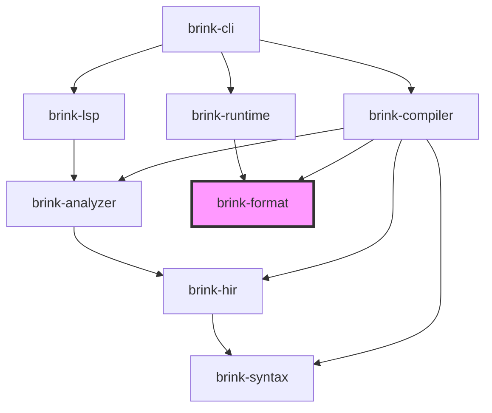

# brink specification

brink is the ink compiler and bytecode runtime for s92-studio, extracted into its own repository to simplify context management for agents. All s92 runtime requirements carry over — this is an organizational separation, not a functional one.

## Crate layout

### Published crates

| Crate | Path | Purpose |
|-------|------|---------|
| `brink` | `crates/brink/` | Public API — re-exports from compiler and runtime |
| `brink-compiler` | `crates/brink-compiler/` | Pipeline driver + codegen backends |
| `brink-runtime` | `crates/brink-runtime/` | Bytecode VM for executing compiled stories |
| `brink-cli` | `crates/brink-cli/` | CLI for compiling and running ink stories |
| `brink-lsp` | `crates/brink-lsp/` | Language server for ink files |

### Internal crates

| Crate | Path | Purpose |
|-------|------|---------|
| `brink-syntax` | `crates/internal/brink-syntax/` | Lexer, parser, lossless CST, typed AST |
| `brink-hir` | `crates/internal/brink-hir/` | HIR types, per-file lowering from AST |
| `brink-analyzer` | `crates/internal/brink-analyzer/` | Cross-file semantic analysis, project database |
| `brink-format` | `crates/internal/brink-format/` | Binary interface between compiler and runtime |

Whether `brink-format` needs to be published is deferred.

### Dependency graph



**Dependency rules:**

1. `brink-runtime` depends ONLY on `brink-format` — nothing else from the brink crate family.
2. `brink-lsp` depends on `brink-analyzer`, NOT on `brink-compiler`.
3. `brink-compiler` depends on `brink-format` (writes) and `brink-analyzer`/`brink-hir`/`brink-syntax` (reads).
4. `brink-format` has no brink-internal dependencies.

## Compilation pipeline

The pipeline is organized as a sequence of passes:

```
Pass 1: Parse          (brink-syntax)     per-file    → AST
Pass 2: Lower          (brink-hir)        per-file    → HIR + SymbolManifest + diagnostics
Pass 3: Merge/Resolve  (brink-analyzer)   cross-file  → unified SymbolIndex + diagnostics
Pass 4: Type-check     (brink-analyzer)   cross-file  → type annotations + diagnostics
Pass 5: Validate       (brink-analyzer)   cross-file  → dead code, unused vars, etc.
Pass 6: Codegen        (brink-compiler)   per-knot    → bytecode + tables
```

The LSP runs passes 1–5. The compiler runs all 6.

### Pass 1: Parse (brink-syntax) — COMPLETE

- **Input:** `.ink` source text
- **Output:** `Parse` — lossless CST (rowan green/red tree) + `Vec<ParseError>`
- **Properties:**
  - Every byte of source appears in exactly one token (lossless roundtrip)
  - Error recovery via `ERROR` nodes — parser never panics, always produces output
  - ~230 `SyntaxKind` variants (tokens + nodes)
  - Typed AST layer with 140+ zero-cost newtype wrappers over CST nodes
  - Pratt expression parser with 10 precedence levels
  - String interpolation with nesting depth tracking

Covers all ink constructs: knots, stitches, choices, gathers, diverts, tunnels, threads, variables, lists, externals, inline logic, sequences, tags, content extensions markup.

### Pass 2: Lower (brink-hir)

- **Input:** `ast::SourceFile` from brink-syntax
- **Output:** `(HirTree, SymbolManifest, Vec<Diagnostic>)`
- **Responsibilities:**
  - Weave folding: flat choices/gathers (identified by bullet/dash count) → flow graph with proper nesting and scope
  - Implicit structure: top-level content before first knot → implicit knot
  - Fall-through diverts: content that falls through to the next stitch/knot → explicit diverts
  - Strip trivia and syntactic sugar
  - Collect declarations into symbol manifest (knots, stitches, variables, lists, externals, unresolved references)
  - Emit structural diagnostics (malformed weave nesting, orphaned gathers, etc.)
- **Scope:** Per-file. Does not require cross-file context.

### Pass 3–5: Analyze (brink-analyzer)

- **Input:** `Vec<(FileId, HirTree, SymbolManifest)>` from all files
- **Output:** `(SymbolIndex, Vec<Diagnostic>)`
- **Responsibilities:**
  - Merge per-file symbol manifests into a unified symbol table
  - Resolve INCLUDE file graph
  - Name resolution: paths → concrete symbols
  - Scope analysis: temp is function-scoped, VAR/CONST are global
  - Type checking: expression types, assignment compatibility
  - Validation: undefined targets, duplicate declarations, dead code, unused variables
  - Circular include detection

The analyzer also owns the **project database** — the stateful, long-lived cache of parsed trees and analysis results. Both the compiler and LSP interact with this:

- **Compiler:** creates a project database, loads all files, runs passes 1–5, feeds results to codegen
- **LSP:** holds a long-lived project database, updates incrementally on file edits, serves queries against cached results

### Pass 6: Codegen (brink-compiler)

- **Input:** HIR trees + resolved `SymbolIndex`
- **Output:** `Program` (defined in brink-format)
- **Responsibilities:**
  - Per-knot bytecode emission
  - Expression lowering → stack ops + jumps
  - Choice lowering → choice set opcodes
  - Sequence lowering → sequence opcodes
  - Divert/tunnel/thread lowering → control flow opcodes
  - String table building (deduplication)
  - Message table building (interpolated text → templates with slot placeholders)
  - Knot directory construction (KnotId ↔ KnotRef mapping)

## Bytecode VM

The runtime is a stack-based bytecode VM.

### Design properties

- Stack-based: operands on value stack
- All jump offsets within a knot are **knot-relative** (not absolute) — changes to other knots don't affect the current knot's bytecode
- Cross-knot jumps use symbolic `KnotRef` (resolved to concrete addresses at load time)
- Short-circuit `and`/`or` handled by compiler (emits conditional jumps), not VM

### Stable identifiers

- **`KnotId(u64)`** — content-addressed hash of fully qualified knot path. Stable across recompilation as long as the knot path is unchanged. Used in all persistent state (position, call stack, visit counts).
- **`KnotRef(u16)`** — compile-time index into the knot directory. Used in bytecode operands. Resolved to concrete addresses at load time. Differs from `KnotId` so bytecode is relocatable.

### Value type

```
Int(i32) | Float(f32) | Bool(bool) | String | List | Null
```

### Opcode categories

The instruction set covers:

- **Stack & literals:** push int/float/bool/string/null, pop, duplicate
- **Arithmetic:** add (including string concat), sub, mul, div, mod, negate
- **Comparison & logic:** equal, not-equal, greater, less, etc., not, and, or
- **Variables:** get/set local, get/set global
- **Control flow:** jump, conditional jump, divert (cross-knot), conditional divert
- **Functions & tunnels:** call (push frame + jump), return (pop frame)
- **Threads:** thread start (fork call stack), thread done
- **Output:** emit string, emit message (format template), emit newline, glue, emit tag
- **Choices:** begin/end choice set, begin/end choice (with sticky/fallback flags), choice condition, choice content markers
- **Sequences:** sequence (with kind: cycle/stopping/once-only/shuffle), sequence branch
- **Intrinsics:** visit count, turns since, turn index, choice count, random
- **External functions:** call external (by ID + arg count)
- **List operations:** create, add, remove, contains, count, min, max, all, none, intersect, union, except, range, value
- **Lifecycle:** done (pause, can resume), end (permanent finish)
- **Debug:** source location mapping (strippable)

The exact opcode encoding is defined in `brink-format`.

## Format (brink-format)

`brink-format` defines the binary interface between compiler and runtime. It is the ONLY dependency of `brink-runtime`.

### Contents

- `Program` struct and all supporting types
- Opcode definitions and encoding
- ID types: `KnotId`, `KnotRef`, `StringId`, `MessageId`, `VarId`, `GlobalVarId`, `ExternalFnId`, `ListDefId`
- Serialization/deserialization

### File formats

- **`.inkb`** — binary format. Mmap-friendly, sectioned. What the runtime loads.
- **`.inkt`** — textual format. Human-readable representation of the bytecode, like WAT is to WASM. For debugging, inspection, and diffing.

### Binary format sections

- String table (offset-indexed, length-prefixed UTF-8)
- Message table (pre-parsed message parts)
- Bytecode (knot headers + packed opcodes)
- Knot directory (KnotId ↔ KnotRef mapping)
- Variable declarations (with defaults)
- Global variable schema
- External function directory
- Debug info (strippable, source maps)
- Checksum

## Runtime (brink-runtime)

### Core requirements

- **Bytecode VM:** stack-based execution of compiled programs
- **Multi-instance:** one compiled program (immutable, shareable), many story instances with isolated per-instance state
- **Hot-reload:** safe recompilation without invalidating running state
- **Deterministic RNG:** per-instance seed/state for reproducible shuffle sequences

### Program (immutable after loading)

Loaded from `.inkb`. Contains string table, message table, knot bytecode, knot directory, variable declarations, global schema, external function directory, debug info. Lookup tables built at load time.

### Story instance (per-entity runtime state)

Each story instance maintains:

- **Position:** symbolic (`KnotId` + offset within knot) — survives recompilation
- **Execution state:** call stack (symbolic frames), value stack
- **Narrative state:** visit counts (per `KnotId`), turn index, sequence states
- **Variables:** local variables
- **RNG state:** per-instance seed + state for deterministic randomness
- **Output buffer:** accumulated content, pending tags, pending choices (cleared each step)
- **Status:** active, waiting for choice, done, ended, error

### Global state (shared across instances)

Global variables shared by all instances of a program. Separate from per-instance locals.

### Execution model

- Synchronous, non-blocking step function
- Runs until a yield point (choice set, done, end, external call) or budget exhaustion
- Returns a `StepResult`:
  - `Continue` — produced text, keep running
  - `ChoicePoint` — waiting for player input (content + choices)
  - `Done` — pause point, can resume
  - `Ended` — permanent finish
  - `Error` — runtime error with source location

### Hot-reload

All persistent references in story instances are symbolic (content-addressed `KnotId`), not raw bytecode addresses. When a program is recompiled:

1. Build symbol table for new program
2. Detect renames via content hashing (removed knot with same content hash as added knot = rename)
3. For each running instance:
   - Migrate renames through KnotId map
   - Verify current position knot exists (reset offset if content hash changed)
   - Unwind call stack to deepest valid frame
   - Reconcile variables (keep existing, add new with defaults, flag removed/changed)
   - Invalidate stale pending choices
4. Return a `ReconcileReport` with warnings for editor integration

### Multi-instance management

A `NarrativeRuntime` (or equivalent) host interface manages:

- Loading/unloading compiled programs
- Spawning/destroying story instances
- Stepping instances and collecting results
- Routing external function calls to host
- Hot-reloading programs and reconciling instances
- Save/load for instances and global state

## LSP (brink-lsp)

Thin protocol adapter over `brink-analyzer`. Depends on analyzer, NOT on compiler.

Planned features:

- Diagnostics (streamed on every change)
- Go to definition (via SymbolIndex position lookup)
- Find references
- Rename (find references → workspace edit)
- Hover (symbol type, doc comment, usage count)
- Autocomplete (knot/stitch names at diverts, globals, local vars)
- Semantic tokens
- Document/workspace symbols
- Signature help (external function parameters)

## Implementation order

### Vertical spike

The first implementation milestone is a vertical spike: a thin slice through every crate that runs a trivial ink story end-to-end. The spike validates that the crate boundaries and interfaces work together before investing heavily in any single crate.

The spike covers: text output, simple choices, diverts between knots, `-> END`. No weave folding, no variables, no sequences, no cross-file includes.

### Spike deliverables

The spike's real output is **interfaces and tests**, not implementations.

1. **Public API surfaces** — each crate gets its public types and function signatures defined first. These are the stable artifacts that survive rewrites.
2. **Boundary tests** — integration tests at each crate boundary that describe what the pipeline produces for specific inputs (parse snapshots, HIR snapshots, bytecode disassembly, execution output). These are the source of truth.
3. **Minimal implementations** — just enough to make the tests pass. These are explicitly disposable.

### Disposability

Spike implementations are v0. They exist to validate interfaces, not to be the final code. When building out a crate for real, **prefer rewriting over patching** if the existing implementation doesn't match the target design. The tests and public API signatures are what matter; everything behind them is throwaway.

Keep spike implementations tiny — the smaller they are, the less inertia they carry.

### Tiers (post-spike)

- **Tier 1:** Full choice semantics (sticky, once-only, fallback, nesting, conditions), gathers, weave folding, variables (local, temp), arithmetic, conditionals, sequences, glue, tags.
- **Tier 2:** Tunnels, threads, external functions, global variables, visit counts, `TURNS_SINCE`, multi-file (`INCLUDE`).
- **Tier 3:** LIST type (definitions, bitset operations, full set operations).

The analyzer grows with each tier — barely exists during the spike, picks up name resolution in tier 1, and gets the full pass suite by tier 2.

## Deferred

The following are real requirements but deferred to later phases:

- **Step budgeting** — `StepBudget::Instructions(n)` for cooperative scheduling, `BudgetExhausted` result variant. The VM will need this for game integration but it's not needed for initial implementation.
- **JSON codegen backend** — inklecate-compatible `.ink.json` output for conformance testing. Decision on whether to build this is deferred.
- **Content extensions** — pluggable compile-time text transforms (speaker attribution, parentheticals, styled text). Still wanted, but the architectural integration (opcode reservation, structured `ContentOutput` types) needs more thought before committing.
- **Localization / message templates** — Fluent-inspired message format, `.inkl` locale overlay files, CLDR plural resolution.
- **`no_std` runtime** — desirable for WASM targets but not an immediate constraint.

## Test corpus

The repository includes a test corpus at `tests/`:

- `tests/tests_github/` — real-world `.ink` files from open-source projects
- 1,115 `.ink` files, 937 golden `.ink.json` files
- Used for parser smoke tests (zero panics), lossless roundtrip validation, and future conformance testing

Fuzz testing and property-based testing infrastructure exists in `brink-syntax`.
