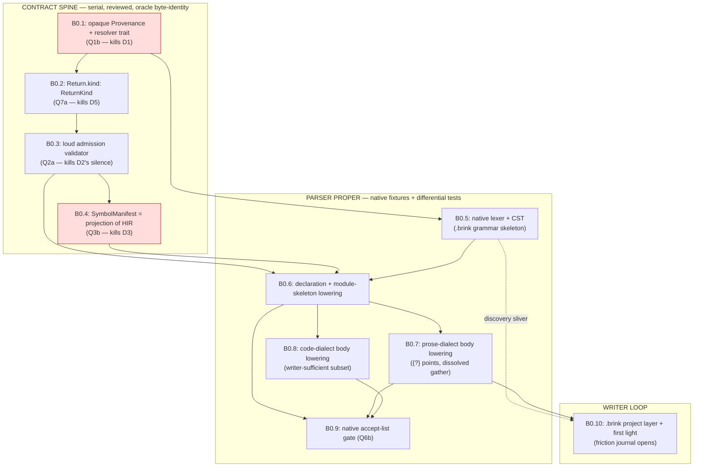

# B0 — prototype native parser: slice sequencing (PROPOSED)

Drafted 2026-07-19, against the **batch-4 delegated ruling** (decision-log
"Delegated batch ruling", stamped onto `docs/hir-admission-contract.md`,
PR #1134): **Q1(b)** opaque `Provenance` + resolver trait, sequenced first ·
**Q2(a)** byte-range-equality join ratified for v1 + loud admission checks
(NodeIds tracked as endgame) · **Q3(b)** `SymbolManifest` becomes a pipeline
projection of HIR · **Q4(b)** two container levels, addressing model written
to generalize · **Q5(a)** chart = body-dialect inside the native frontend ·
**Q6(b)** native accept-list gate · **Q7(a)** explicit `Return.kind`.

**Standing caveat, inherited by every slice**: the batch-4 rulings were
adopted from summaries, **not fully reviewed**. Any downstream surprise is
flagged loudly to the maintainer; the settled-deliberation presumption does
not apply at full strength. Nothing below is ratified until the decision-log
says so — everything in this document is PROPOSED.

Authorities: `docs/hir-admission-contract.md` + `-findings.md` (D1–D9,
F-A…F-K) · `docs/native-surface-charter.md` (§10 exit criterion: **the
writer authoring real scenes with a friction journal**) · decision-log
2026-07-19 run (lambdas/RustScript, companions S4, strict-only posture,
`.brink`, NS-T/NS-D elevation) · `docs/stdlib-sequencing.md` (wave format) ·
tracker #1106 (end state: "the prototype parser lowers to *tested* HIR").

The organizing axis is **blast radius**. B0.1–B0.4 are contract-cleanup
slices that touch the **ink frontend's own plumbing** (provenance, manifest
projection) — the dangerous ones, oracle-guarded, serial spine. B0.5–B0.10
are the parser proper — new surface, vanilla-unreachable by construction,
guarded by the admission checks the spine just built (the checks *are* the
new tests).

---

## 1. Dependency graph

Reading the graph: **B0.1 → B0.2 → B0.3 → B0.4 → B0.6 → B0.7 → B0.10** is
the critical path to the season's exit criterion (the writer's first
authored scene). B0.5 runs **parallel to the spine** after B0.1 (it touches
no ink plumbing) and must be done when B0.4 lands so B0.6 starts
immediately. B0.8 is a parallel lane off B0.6 (the body-dialect seam keeps
it disjoint from B0.7) and is **not** on the writer's critical path — the
writer authors scenes in the prose dialect. The two red nodes are the
highest-risk slices (widest ink-frontend blast radius).

The ruled sequencing constraint, honored: **Q1(b) provenance decoupling
comes first** — it is substrate the ink frontend needs too, and every other
cleanup assumes it. Q7(a) is its prerequisite rider (once provenance is
uniform, pointer presence can no longer carry the tunnel-return bit), so
B0.1 carries a temporary shim and B0.2 retires it immediately after. Then
the D2/Q2(a) loud checks, then the Q3(b) projection, THEN the parser.

---

## 2. Slice decomposition (one reviewable PR each, pump-shaped)

### B0.1 — opaque `Provenance` + resolver trait (spine, serial)
**Scope.** Replace every HIR `ptr: AstPtr<ast::X>` / `SyntaxNodePtr` /
`ContainerPtr` with an opaque `Provenance { file, range, kind_token }`
(contract §5 Q1(b)); a frontend-supplied **resolver trait** owns
node-resolution (the ink frontend keeps `AstPtr` *behind* its resolver;
native will supply its own). Migrate the ~15 ptr-consumer sites (F-C:
`brink-ide/{folding,story_graph,hir_projection,fn_value_hover}.rs`,
`brink-fmt`, ~10 analyzer `HirVisitor` passes). `ContainerPtr`'s
variant-discrimination role (F-I#5, the #626 floating-stitch trap) survives
as a kind-token so B0.3 can check it. All provenance stays `Eq/PartialEq`
(F-J: salsa early-cutoff; ranges remain both cache-poison and identity-key).
**Excludes.** The `Return.ptr` semantic bit — a temporary shim preserves
ptr-presence semantics through this slice (retired in B0.2). Any admission
checking.
**Discharges.** Q1(b); D1 (the structural dragon — the one coupling that
cannot be papered over).
**Entry.** Batch-4 ruling stamped (done, #1134).
**Exit (tests).** Workspace green; **oracle byte-identical**
(`CASES 350/14/390`, `EPISODES` at `RATCHET_EPISODE_COUNT`); IDE + fmt suites green; a
resolver round-trip test (ink node → `Provenance` → live node) and a
non-resolving-provenance test (headless compile never resolves ptrs —
contract §4.3, precisely why native codegen can ship before native IDE
support).
**Lane.** Spine — the widest-blast-radius slice in all of B0. Zero behavior
change; a pure representation migration.

### B0.2 — explicit `Return.kind: ReturnKind` (spine, small rider)
**Scope.** `ReturnKind { Explicit, TunnelRedirect }` on `Return`; `E032`
(return-outside-function) keys off `kind`, never ptr presence
(`validate.rs:223` today); the two ink `Return`-construction sites stamp it;
delete the B0.1 shim so `Return` provenance becomes uniform. This is also
the enabling bit for the sitting-2 respell `return -> x` (tunnel
return-redirect) — the native lowering will stamp `TunnelRedirect`
explicitly instead of withholding a pointer.
**Discharges.** Q7(a); D5 (semantics smuggled through pointer presence);
F-I#6.
**Entry.** B0.1 merged.
**Exit (tests).** E032 fixture pair (explicit `return` outside a function =
error; tunnel return = clean; a provenance-carrying tunnel return = *still*
clean — the trap this slice kills); oracle byte-identity.
**Lane.** Spine (a few lines; rides directly behind B0.1 as one review).

### B0.3 — the loud admission validator (spine)
**Scope.** `validate_admission(&HirFile, &SymbolManifest) -> Vec<Diagnostic>`,
non-suppressible, wired at the single AST→HIR seam (F-B: `lowered_query`).
The contract §4.2 checks, each a hard error with a fresh reserved `Exxx`
code (never-reuse rule): (1) **manifest ⇄ HIR agreement** — every
`UnresolvedRef.range` matches a real referencing-expr range; every declared
symbol has a same-name/kind HIR node; `is_function` ⇄ the `"function"`
sentinel (F-I#4); (2) **range well-formedness + join-key uniqueness** —
non-empty, in-bounds, no two references share a range. This is the ruled
**Q2(a)** move: the byte-range-equality join is *ratified as contract* and
its silent-failure mode becomes a loud admission error (NodeIds stay the
tracked endgame); (3) **name-convention conformance** — `knot.stitch`,
`knot[.stitch].label`, `List.item` qualification shapes made explicit and
checked (F-I#3); (4) **control-flow classification** — `ReturnKind`
present, divert-last-in-inline-branch, terminal-stmt rules (F-I#7);
(5) **provenance-kind ⇄ `SymbolKind`** consistency (F-I#5). Trusted, not
validated (§4.3): resolvability, types, range↔text fidelity, provenance
resolvability.
**Discharges.** Q2(a); D2 (the silent-failure dragon — the coupling most
likely to burn the native frontend, invisible in code review); guards D3
until B0.4 retires it.
**Entry.** B0.2 merged (checks #4/#5 reference `ReturnKind` + kind-tokens).
NF-6 (validator run mode) ruled — rec: always-on per the tier-1
never-fail-silently posture (2026-07-18 capability-manifest ruling).
**Exit (tests).** The **entire existing corpus is admission-clean** — the
ink frontend passes its own gate with zero new diagnostics (this run is the
proof the checks encode reality, not aspiration); one malformed-triple
fixture per E-code trips its check (#672-A posture, direct + pipeline);
oracle byte-identity; salsa hot-path perf budget measured (the validator
runs on every lowering).
**Lane.** Spine.

### B0.4 — `SymbolManifest` becomes a pipeline projection of HIR (spine)
**Scope.** `project_manifest(&HirFile) -> SymbolManifest` as a pipeline
pass; HIR gains the per-reference **scope context** it currently lacks (the
one gap F-A/Q3 names); the ink frontend's hand-built manifest path is
deleted after differential burn-in; the two independent local-DefinitionId
hash sites (F-I#2: `insert_local` vs `lookup_local_in_scope`) collapse to
one; B0.3's check #1 (manifest⇄HIR agreement) retires into the projection's
own unit tests — you cannot disagree with yourself. `LoweredFile` shape and
`PartialEq` early-cutoff preserved (F-J).
**Discharges.** Q3(b); D3 (two artifacts kept consistent by hand); F-I#2.
**Entry.** B0.3 green — its agreement checks are the live tripwire during
the swap.
**Exit (tests).** **Differential burn-in**: both paths run across the whole
corpus, projected manifest asserted structurally identical to the legacy
one, *before* the legacy path is deleted; the frozen-`.inkb` tripwire
`known_good_bare_definition_ids` untouched (DefinitionId = (module, name)
stability, #719); oracle byte-identity.
**Lane.** Spine — second-widest blast radius (every `.inkb` address flows
through the manifest's DefinitionIds).

### B0.5 — native lexer + CST: the `.brink` grammar skeleton (parallel lane, spine-reviewed)
**Scope.** Token set + error-resilient CST for the ruled surface: `flow`/
`fn` declarations with braced bodies; decl keywords `var const flags struct
extern import use module`; the annotated-brace family openers (`{expr}`
interpolation, `{if`/`{match`, `{~ {& {! {|` alternations, `{?` points,
`-` entry markers *inside annotated blocks only* — gathers are gone, a
leading dash in plain prose is text); choice-line anatomy kept as-is (`*`/
`+`, `[]` split, `(label)`, `<>` glue, `else { }` fallback); diverts kept
verbatim (`->`, `-> x ->`, `-> END/DONE`, `return -> x`); splice `<-` only
inside points; `::`/`.` separator stratification + the casing partition
(snake_case modules / UpperCamel types, compile-checked — S4 rider);
`@[…]` annotations with the **paren-clause grammar** (`reads(gold, hp)` —
the ruled form, not the drifted colon form: the D9 lesson, recognizers
don't define the contract); `//` `/* */` trivia; lambda pipes `|x|`
tokenized (lowering landed later, in #1685 — see §3). The **body-dialect seam** is a parser
dispatch point (prose vs code ground per container; chart #905 plugs in
here later — Q5(a)). Whitespace never load-bearing; every structural mark
renderer-elidable (charter §2).
**Discharges.** Substrate for Q6(b); the Q5(a) seam physically exists.
**Entry.** B0.1 merged (the CST's provenance story is designed against
opaque `Provenance` from day one — never `AstPtr`); **NF-1** (crate home —
rec: new `crates/internal/brink-syntax-native`) and **NF-2** (surface
subset) ruled.
**Exit (tests).** CST insta snapshots incl. error-recovery fixtures;
lossless lexer round-trip property (tokens + trivia reconstruct source —
the fmt/renderer prerequisite); the two charter exhibits (the Fogg passage,
`FUNC_populate_options_thread` respelled) parse clean.
**Lane.** **Parallel** to B0.2–B0.4 (touches no ink plumbing); reviewed at
spine strength when it lands — it fixes the token vocabulary the writer
will live in.

### B0.6 — declaration + module-skeleton lowering (spine)
**Scope.** CST → HIR for the declaration layer: `flow`/`fn` →
`Knot { is_function }` (one encoding, stamped consistently with the index
sentinel — F-I#4 now *checked* by B0.3); nested `flow` → `Stitch` at
**exactly two levels — Q4(b)**: depth-3 nesting parses and is rejected with
a targeted native diagnostic ("not yet; #905's round"), never silently
flattened; params (`ref`, divert-typed, annotations); `var const flags
struct extern` → decls; the directive channels populated from native
keyword syntax (F-E's clean-channel bet cashed: `is_local`,
`effects_assertion`, `module`, visibility, `@[was]`); `import`/`use` →
`ModuleDecl`/`Imports` (naming only — the tree is the compilation
universe); **flat hoisted global vecs produced by the native route** (D6:
the contract says "flat and hoisted", not "walk descendants");
`root_content = Block::default()` and `includes` empty, except the single
synthesized `flow main()` entry divert (2026-07-21 ruling); `includes`
stays empty always (ink-only baggage, enforced by B0.9). Names stamped in
the exact qualification
conventions B0.3 checks. Manifest via B0.4's projection — the native
frontend emits **HIR only**, the payoff of Q3(b).
**Discharges.** First real second-client exercise of Q1(b)+Q3(b); the
Q4(b) fence made loud; D6 honored.
**Entry.** B0.3 + B0.4 + B0.5 merged.
**Exit (tests).** HIR insta snapshots for declaration fixtures; **the B0.3
admission validator green over native output** — the tracker's "lowers to
*tested* HIR" begins meaning something here: the admission checks are the
new tests; negative fixtures (depth-3 nesting, malformed casing, bad
qualification) each produce their targeted diagnostic.
**Lane.** Spine.

### B0.7 — prose-dialect body lowering (spine — the heart)
**Scope.** Content lines, tags, glue `<>`, `{expr}` interpolation (bare
brace = interpolation and nothing else, ever); annotated-brace family →
`Conditional{IfElse/Switch}` / `Sequence` (bitmask); **`{?}` points** →
`ChoiceSet`/`Choice` (sticky/once, `[]` split, labels, `* {if cond}`
guards), `else { }` → `is_fallback`, splice `<- flow(args)` →
`ThreadStart`; **the dissolved gather**: `ChoiceSet.continuation`
synthesized from the statements following the closed `{?}` block — same
HIR, structure now visible; diverts/tunnels verbatim, `return` /
`return -> x` stamping `ReturnKind` explicitly (B0.2's payoff). **D4
posture**: `ChoiceSet.depth`/`context` are weave-fold bookkeeping the
native frontend does not have — B0.7 stamps the documented-neutral values
(`depth = 0`, `context = Inline`) as *native-normal*, recorded in the
accept-list, rather than faking ink's fold. The contract's own preference
is optional/removed fields; that relaxation was **not** in the Q-batch —
if any downstream pass turns out to inspect these values, flag loudly per
the not-fully-reviewed caveat (this is the likeliest tripwire in B0).
**Discharges.** Charter §5 (the single most identity-altering respelling);
exercises D4 honestly.
**Entry.** B0.6 merged; NF-5 (differential method) ruled.
**Exit (tests).** **Respelled-differential episode tests** — the flagship:
selected tier-1 cases respelled in `.brink` compile and replay
**episode-identical** to their ink spellings on the existing harness (the
oracle then guards the native surface transitively: ink ↔ oracle, native ↔
ink); HIR snapshots; admission + accept-list green; both charter exhibits
lower and run.
**Lane.** Spine.

### B0.8 — code-dialect body lowering, writer-sufficient subset (parallel lane)
**Scope.** The code ground over **existing HIR only** (NF-2's fence):
`let`/temp decls, assignment incl. RMW field paths, calls, `if`/`match`
statements → `Conditional`, `while`/`for` (existing single-binding
`ForStmt`), expression statements, `return` with `ReturnKind`, UFCS *call
shape* `x.foo(y)` → the existing `FieldAccess`/`Call` ambiguity the
analyzer already owns (`hir/types.rs:712`), `#fn` function values →
`FnLiteral`, `await` at statement position in flows only, preserving
source pre-order of await sites (F-H: continuation identity depends on
it — an admission-relevant obligation this slice must test). No tildes —
code is the ground.
**Discharges.** The three-axes ruling's "code-bodied `flow` honestly
spellable" (the Compound guard); F-H's frontend obligation.
**Entry.** B0.6 merged. Runs **parallel to B0.7** — the body-dialect seam
keeps the lanes disjoint.
**Exit (tests).** Differential-vs-brink-dialect tests: the same logic
authored in the brink dialect and in `.brink` lowers to equal HIR modulo
provenance (snapshot equality mod ranges) — Track A's tested semantics
inherited, not co-developed; await-site pre-order fixture; admission green.
**Lane.** Parallel (not on the writer's critical path).

### B0.9 — the native accept-list admission gate, Q6(b) (small spine, lands incrementally)
**Scope.** The inverse of the ink reject-list `dialect_gate`: an
**accept-list** enumerating legal native HIR shapes, rejecting (a)
ink-only baggage a native file must never contain — nonempty
`root_content`, any `IncludeSite`, ambient `ThreadStart` outside
point-splice position, weave-fold values other than the B0.7-documented
neutrals — and (b) not-yet-lowered constructs, **loudly** (§4.4's
additive-open / closed-to-silent-extension posture: parse `enum`, emit
"ruled but not yet lowered", never drop). Keyed off the producing
frontend at the pipeline level, never a tree tag (F-I#10). Native is
strict-only (2026-07-19 posture): the gate also refuses a `types =
gradual` knob for `.brink` compiles.
**Discharges.** Q6(b); §4.4; the strict-only ruling's enforcement point.
**Entry.** B0.6 (first real native HIR); grows a check-row with each of
B0.7/B0.8; final review at their close.
**Exit (tests).** Fixture-per-rejection; native fixture corpus gate-clean;
an ink-baggage injection test trips it; a gradual-knob `.brink` compile is
a hard error.
**Lane.** Small spine, incremental.

### B0.10 — `.brink` in the project layer + writer first light (parallel lane, serial checkpoint)
**Scope.** Extension registration (`.brink`, ruled 2026-07-19); source
discovery per NF-3 (rec: a declared source root in `brink.toml`
(`brink-project-config` already walks up from entries), filesystem-derived
module paths — path on disk = path in language — the tree-is-universe walk
scoped to that root; the INCLUDE-closure machinery is **never** consumed
for `.brink`; many-roots per the modules ruling); `brink-cli` compile path
(`brink compile scene.brink` → `.inkb` → runtime episode); dialect wiring
(native strict-only, via `AnalysisOptions` — never in the tree); **the
friction journal opens** (charter §10: the writer is the designated cold
reader; every confusion journaled, the Compound method applied to
notation); the bare-diff/grep legibility check (§10 caveat b) run
deliberately. **NS-T dependency flagged, not owned**: the writer validates
*through the editor* (#1131 — minimum first-light bar: syntax highlighting
+ diagnostics surfacing). B0.10 coordinates the bar; NS-T ships it.
**Discharges.** The season's exit criterion becomes reachable; the NS-T
coupling surfaced as the schedule risk it is.
**Entry.** Discovery sliver after B0.5 (parallel); **first-light
checkpoint** requires B0.6 + B0.7 + the NS-T minimum bar. NF-3 + NF-4
ruled.
**Exit (tests).** End-to-end: a `.brink` scene compiles and plays through
the runtime; a **real scene authored by the writer** compiles, plays, and
the journal has entries. That last clause is the exit criterion for B0 as
a whole.
**Lane.** Parallel, with a serial first-light checkpoint on the critical
path.

---

## 3. Honest scope fences — what B0 is NOT

- **Chart body-dialect (#905)** — Q5(a) makes it a body grammar *inside*
  the native frontend, later round. B0 ships only the seam (B0.5's
  dispatch point). Chart is also the client that will force Q4(a).
- **Deep nesting > `knot.stitch`** — Q4(b) deferred. B0.6 rejects loudly;
  the addressing model and name conventions are *written* to generalize
  (no new `.matches('.').count()==2`-style assertions added anywhere).
- **B1–B5 spellings stay unfiled** until B0 + the code-dialect sitting
  reshape them (#1106): `or`/`as` (B1), **`for k, v`** (B2 — the one
  additive HIR field `val_name` lands with B2, not B0), UFCS **auto-ref
  resolution** (B3 — B0.8 parses the call shape only), display-boundary
  None-render (B4). **B5 is no longer unfiled**: `TypeName { … }`
  construction was ruled by #1103 (2026-07-23) and built by #1464 — the
  native grammar (`CONSTRUCT_LITERAL`/`CONSTRUCT_ENTRY`) plus the
  `construct` protocol registry (`brink_ir::hir::construct`), std-only.
- **Lambdas** — ~~ruled but unlowered~~ **LOWERED** (issue #1685). The
  anonymous-body node this entry was waiting on exists: `hir::Expr::Lambda`
  / `LambdaBody`, lowered by `hir::lower_native::lambda` per the 2026-07-19
  ruling (pipes, colon returns, optional param annotations, expression or
  braced-block bodies with the tail as the value, by-value capture with
  `E156` for a write to a captured binding). `FnLiteral` remains what it
  always was — partial application over a *named* target — and is a
  different shape, not a substitute. The runtime representation — the
  follow-up slice this entry left open — **LANDED** (issue #1709):
  `lir::lower::lambda` lifts the body into a synthesized top-level function
  and creates an ordinary T1c fn value over it (`PushFnRef` with no
  captures, `MakeClosure` with them), retiring the `E052` fence. Still
  open: the lifted function's **effect row**, which `Ty::Fn` cannot carry
  (#1680).
- **Enums** — ruled (§13.1) but no HIR node exists; the contract reserves
  the `HirFile.enums` channel; the node + exhaustive `match` land with the
  enum feature, not B0.
- **`impl` blocks / companions (S4)** — a lowering rule (virtual
  companion module), no new node — but it leans on module machinery and
  the code sitting's remaining details; post-B0.
- **Blocks-as-values, inline markup/rich text** — parking lot (semantic
  rounds; not same-semantics).
- **Mixed ink/native trees, converters, migration** — charter §8.5's
  unresolved remainder. B0 supports ink and native stories side-by-side at
  the project level only; intra-story mixing is its own round (cross-
  dialect calls are ruled mediated — `Unknown` at the seam — but the
  project-layer plumbing is not B0's).
- **The flat-choice-run compact spelling** — open charter item (§10
  caveat a); B0 ships the ceremony-tax form and lets the friction journal
  price it. Prime journal-watch item.
- **NodeId join keys** — Q2's endgame, tracked, not B0.
- **D4 field removal** (`depth`/`context` optionality) — B0.7 stamps
  neutrals; the field-level cleanup is a post-B0 contract amendment.
- **Editor/LSP/fmt/renderer = NS-T (#1131); the book = NS-D (#1132)** —
  first-class sibling workstreams, not B0 slices; B0.10 names the
  first-light dependency on NS-T.

---

## 4. Recommended order

**Critical path (serial spine, reviewed slices):**
`B0.1 → B0.2 → B0.3 → B0.4 → B0.6 → B0.7 → B0.10-checkpoint`.

**Parallel lanes:** `B0.5` (after B0.1, concurrent with B0.2–B0.4 — must
be done when B0.4 lands); `B0.8` (after B0.6, concurrent with B0.7);
`B0.9` (incremental beside B0.6–B0.8); `B0.10`'s discovery sliver (after
B0.5).

**Blocking-finding gates before code** (the stdlib-sequencing §4 pattern —
findings in `b0-findings.md`):

| Slice | Blocked on ruling |
|---|---|
| B0.3 | NF-6 (validator run mode — rec always-on; non-blocking if rec adopted) |
| B0.5 | NF-1 (lexer/CST home), NF-2 (surface subset) |
| B0.7 | NF-5 (differential-test method — gates the *exit criterion*, not the start) |
| B0.10 | NF-3 (`.brink` discovery), NF-4 (first-light gate) |

---

## 5. Oracle / regression posture per slice

The principle: **the contract-cleanup spine touches the ink frontend's own
plumbing and is guarded by the oracle; the parser slices are
vanilla-unreachable and are guarded by the admission machinery the spine
built.** The full gate on every slice: `CASES 350/14/390`,
`EPISODES` at `RATCHET_EPISODE_COUNT`, byte-identical; ratchet untouched
(`RATCHET_EPISODE_COUNT`); wasm-observable changes carry a
`@brink-lang/web` changeset; branch pushed after every commit (the #1137
lesson).

| Slice | Danger | Guardrails |
|---|---|---|
| B0.1 | **HIGH** — every HIR node, ~15 consumer sites, salsa Eq | oracle byte-identity · IDE/fmt suites · resolver round-trip · zero behavior change by construction |
| B0.2 | low | E032 fixture pair · oracle byte-identity |
| B0.3 | medium — new always-on pass on the hot path | corpus-wide admission-clean run (zero new diagnostics) · per-check malformed fixtures · perf budget |
| B0.4 | **HIGH** — every `.inkb` address flows through the manifest | dual-path differential burn-in before deletion · `known_good_bare_definition_ids` tripwire · oracle byte-identity |
| B0.5 | none to ink | CST snapshots · lossless round-trip property |
| B0.6 | none to ink | admission validator green over native output · negative fixtures |
| B0.7 | none to ink (D4 neutrals = watch item) | respelled-differential episode tests · accept-list |
| B0.8 | none to ink | HIR-equality-vs-brink-dialect differentials · await pre-order fixture |
| B0.9 | none to ink | fixture-per-rejection · injection tests |
| B0.10 | low (project layer) | end-to-end compile-and-play · existing project-config tests |

---

**Summary: 10 slices — 7 spine (B0.1, B0.2, B0.3, B0.4, B0.6, B0.7, B0.9)
/ 3 parallel lanes (B0.5, B0.8, B0.10).** Everything PROPOSED; findings in
`b0-findings.md` are phone-rulable.
