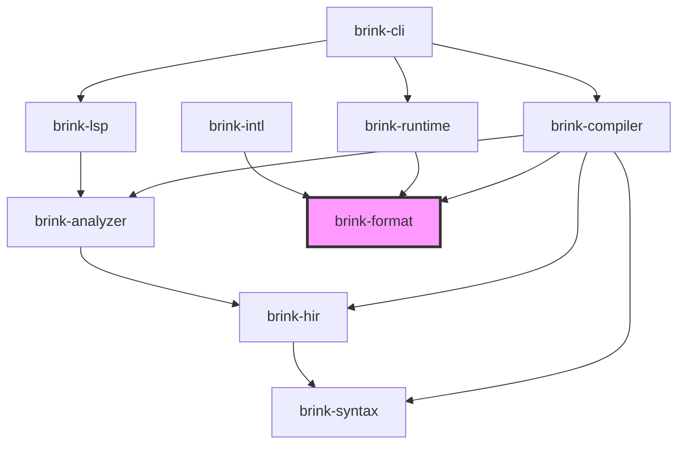

# brink specification

brink is the ink compiler and bytecode runtime for s92-studio, extracted into its own repository to simplify context management for agents. All s92 runtime requirements carry over — this is an organizational separation, not a functional one.

## Crate layout

### Published crates

| Crate | Path | Purpose |
|-------|------|---------|
| `brink` | `crates/brink/` | Public API — re-exports from compiler and runtime |
| `brink-compiler` | `crates/brink-compiler/` | Pipeline driver + codegen |
| `brink-runtime` | `crates/brink-runtime/` | Bytecode VM for executing compiled stories |
| `brink-cli` | `crates/brink-cli/` | CLI for compiling and running ink stories |
| `brink-lsp` | `crates/brink-lsp/` | Language server for ink files |
| `brink-intl` | `crates/brink-intl/` | Batteries-included plural resolution (ICU4X baked data) |

### Internal crates

| Crate | Path | Purpose |
|-------|------|---------|
| `brink-syntax` | `crates/internal/brink-syntax/` | Lexer, parser, lossless CST, typed AST |
| `brink-hir` | `crates/internal/brink-hir/` | HIR types, per-file lowering from AST |
| `brink-analyzer` | `crates/internal/brink-analyzer/` | Cross-file semantic analysis, project database |
| `brink-format` | `crates/internal/brink-format/` | Binary interface between compiler and runtime |

Whether `brink-format` needs to be published is deferred.

### Dependency graph



**Dependency rules:**

1. `brink-runtime` depends ONLY on `brink-format` — nothing else from the brink crate family.
2. `brink-lsp` depends on `brink-analyzer`, NOT on `brink-compiler`.
3. `brink-compiler` depends on `brink-format` (writes) and `brink-analyzer`/`brink-hir`/`brink-syntax` (reads).
4. `brink-format` has no brink-internal dependencies.
5. `brink-intl` depends ONLY on `brink-format` (for `PluralCategory` and `PluralResolver` trait).

## Compilation pipeline

The pipeline is organized as a sequence of passes:

```
Pass 1: Parse          (brink-syntax)     per-file       → AST
Pass 2: Lower          (brink-hir)        per-file       → HIR + SymbolManifest + diagnostics
Pass 3: Merge/Resolve  (brink-analyzer)   cross-file     → unified SymbolIndex + diagnostics
Pass 4: Type-check     (brink-analyzer)   cross-file     → type annotations + diagnostics
Pass 5: Validate       (brink-analyzer)   cross-file     → dead code, unused vars, etc.
Pass 6: Codegen        (brink-compiler)   per-container  → bytecode + tables
```

The LSP runs passes 1–5. The compiler runs all 6.

### Pass 1: Parse (brink-syntax) — COMPLETE

- **Input:** `.ink` source text
- **Output:** `Parse` — lossless CST (rowan green/red tree) + `Vec<ParseError>`
- **Properties:**
  - Every byte of source appears in exactly one token (lossless roundtrip)
  - Error recovery via `ERROR` nodes — parser never panics, always produces output
  - ~230 `SyntaxKind` variants (tokens + nodes)
  - Typed AST layer with 140+ zero-cost newtype wrappers over CST nodes
  - Pratt expression parser with 10 precedence levels
  - String interpolation with nesting depth tracking

Covers all ink constructs: knots, stitches, choices, gathers, diverts, tunnels, threads, variables, lists, externals, inline logic, sequences, tags, content extensions markup.

### Pass 2: Lower (brink-hir)

- **Input:** `ast::SourceFile` from brink-syntax
- **Output:** `(HirTree, SymbolManifest, Vec<Diagnostic>)`
- **Responsibilities:**
  - Weave folding: flat choices/gathers (identified by bullet/dash count) → container tree with proper nesting and scope
  - Implicit structure: top-level content before first knot → root container
  - INCLUDE content merging: top-level content from included files is inlined at the INCLUDE location; knots are separated and appended to the story
  - First-stitch auto-enter: the first stitch in a knot is entered via implicit divert; other stitches require explicit diverts
  - Strip trivia and syntactic sugar
  - Collect declarations into symbol manifest (knots, stitches, variables, lists, externals, unresolved references)
  - Emit structural diagnostics (malformed weave nesting, orphaned gathers, etc.)
- **Scope:** Per-file. Does not require cross-file context.

### Pass 3–5: Analyze (brink-analyzer)

- **Input:** `Vec<(FileId, HirTree, SymbolManifest)>` from all files
- **Output:** `(SymbolIndex, Vec<Diagnostic>)`
- **Responsibilities:**
  - Merge per-file symbol manifests into a unified symbol table
  - Resolve INCLUDE file graph
  - Name resolution: paths → concrete symbols (DefinitionIds)
  - Scope analysis: temp is function-scoped, VAR/CONST are global
  - Type checking: expression types, assignment compatibility
  - Validation: undefined targets, duplicate declarations, dead code, unused variables
  - Circular include detection

The analyzer also owns the **project database** — the stateful, long-lived cache of parsed trees and analysis results. Both the compiler and LSP interact with this:

- **Compiler:** creates a project database, loads all files, runs passes 1–5, feeds results to codegen
- **LSP:** holds a long-lived project database, updates incrementally on file edits, serves queries against cached results

### Pass 6: Codegen (brink-compiler)

- **Input:** HIR trees + resolved `SymbolIndex`
- **Output:** bag of `ContainerBytecode` blobs + string table + message table + metadata (written to `.inkb`)
- **Responsibilities:**
  - Per-container bytecode emission
  - Expression lowering → stack ops + jumps
  - Choice lowering → choice point opcodes (see [Choice text decomposition](#choice-text-decomposition))
  - Sequence lowering → sequence opcodes
  - Divert/tunnel/thread lowering → control flow opcodes
  - Implicit diverts: end-of-root-story gets implicit gather + `-> DONE`
  - Text decomposition: static text blocks → message templates with slot placeholders (see [Text decomposition](#text-decomposition))
  - String table building (deduplication of plain text)
  - Message table building (interpolated/structured text → `MessageTemplate` entries)
  - Line ID generation for voice acting support (see [Voice acting](#voice-acting))
  - All cross-definition references use `DefinitionId` — no resolved indices in the output

## Definitions and DefinitionId

All named things in the format — containers, global variables, list definitions, list items, and external functions — use a single `DefinitionId(u64)` type. The high 8 bits are a type tag identifying which table the definition belongs to; the low 56 bits are a hash of the fully qualified name/path.

```
DefinitionId (u64):
┌──────────┬──────────────────────────────────────────────────┐
│ tag (8)  │                  hash (56)                       │
└──────────┴──────────────────────────────────────────────────┘
```

The linker resolves all `DefinitionId` references uniformly to compact runtime indices. The runtime never sees `DefinitionId` on the hot path — they're resolved at link time. Persistent state (save files, visit counts) stores `DefinitionId` for stability across recompilation.

### Definition tags

| Tag | Kind | Payload |
|-----|------|---------|
| `0x01` | Container | Bytecode blob, content hash, counting flags |
| `0x02` | Global variable | Name, value type, default value, mutable flag |
| `0x03` | List definition | Name, items (name + ordinal each) |
| `0x04` | List item | Origin list `DefinitionId`, ordinal |
| `0x05` | External function | Name, arg count, optional fallback `DefinitionId` |

### Containers (tag `0x01`)

Containers are the fundamental compilation and runtime unit, analogous to functions in a normal programming language. At the source level, ink has knots, stitches, gathers, and labeled choice targets. At the bytecode level, these are all **containers** — there is no distinction. This matches the reference ink runtime, which has a single `Container` type.

Each container definition has:

- **`DefinitionId`** — `0x01` tag + hash of fully qualified path (e.g., `hash("my_knot.my_stitch")`). Stable across recompilation as long as the path doesn't change.
- **Bytecode** — its own instruction stream
- **Content hash** — fingerprint of the bytecode, used during hot-reload to detect whether a container's implementation changed
- **Counting flags** (bitmask):
  - Bit 0: `visits_should_be_counted` — track visit count
  - Bit 1: `turn_index_should_be_counted` — record which turn it was visited on
  - Bit 2: `counting_at_start_only` — only count when entering at the start, not when re-entering mid-container

#### Container hierarchy

```
Root container
├── [top-level content]
├── Knot A (container)
│   ├── [knot content before first stitch]
│   ├── Stitch X (container)
│   │   ├── [stitch content]
│   │   └── Gather (container, may be labeled)
│   └── Stitch Y (container)
└── Knot B (container)
```

- The first stitch in a knot is auto-entered via an implicit divert. Other stitches require explicit `-> stitch_name`.
- Stitches do NOT fall through to each other.
- The root story container gets an implicit final gather + `-> DONE` appended by the compiler.

#### Execution as a container stack

The VM maintains a stack of container frames. Entering a container pushes a frame. Finishing a container (reaching end of its bytecode) pops the frame and resumes the parent. Diverts jump to a different container. Tunnels push/pop frames explicitly. Threads fork the frame stack.

### Global variables (tag `0x02`)

Each variable definition has:

- **`DefinitionId`** — `0x02` tag + hash of variable name
- **Name** — `StringId` (for debugging/inspection)
- **Value type** — the type of the default value
- **Default value** — `Value` (same type as the VM stack)
- **Mutable** — `bool` (`true` for `VAR`, `false` for `CONST`)

`VAR` declarations are mutable globals. `CONST` declarations are immutable globals — they always exist in the format (visible, inspectable, debuggable). The compiler may inline CONST values as a build-time optimization controlled by a compiler flag, but the definition is always present. Attempting to `SetGlobal` on an immutable variable is a runtime error.

Temporary variables (`temp`) have no format-level definition. They are stack-frame-local — created by a `DeclareTemp` opcode during execution, stored in the current call frame, and discarded when the frame pops.

#### Bytecode instructions for variables

```
GetGlobal(DefinitionId)     // push global variable value
SetGlobal(DefinitionId)     // pop stack → assign to global (runtime error if immutable)
DeclareTemp(u16)            // declare temp at local slot index in current frame
GetTemp(u16)                // push temp value from frame slot
SetTemp(u16)                // pop stack → assign to frame slot
```

Globals use `DefinitionId` (resolved by linker to fast runtime index). Temps use frame-local slot indices assigned by the compiler — no `DefinitionId`, no linker involvement.

### List definitions (tag `0x03`)

Each list definition has:

- **`DefinitionId`** — `0x03` tag + hash of list name
- **Name** — `StringId`
- **Items** — `Vec<(StringId, i32)>` (item name + ordinal)

Ordinals can be non-contiguous and negative (e.g., `LIST foo = (Z = -1), (A = 2), (B = 3), (C = 5)`). The linker builds efficient runtime representations (bitset mappings, lookup tables) from this.

### List items (tag `0x04`)

Each list item is an independent definition, because bare item names are implicitly global in ink — `happy` resolves to a single-element list value `{Emotion.happy: 1}`.

- **`DefinitionId`** — `0x04` tag + hash of qualified name (e.g., `hash("Emotion.happy")`)
- **Origin** — `DefinitionId` of the parent list definition
- **Ordinal** — `i32`

#### List values

A list value (for variable defaults and as literals in bytecode) is a set of items, potentially from multiple origin definitions:

```
ListValue {
    items: Vec<DefinitionId>      // list item DefinitionIds that are "set"
    origins: Vec<DefinitionId>    // list definition DefinitionIds (for typed empties)
}
```

The `origins` field preserves type information for empty lists — needed for `LIST_ALL` and `LIST_INVERT` to know the full universe of possible items.

### External functions (tag `0x05`)

Each external function definition has:

- **`DefinitionId`** — `0x05` tag + hash of function name
- **Name** — `StringId`
- **Arg count** — `u8`
- **Fallback** — `Option<DefinitionId>` pointing to a container (tag `0x01`) with the ink-defined fallback body

The linker resolves external function calls at load time:

1. **Host provides a binding** → resolved to host call
2. **No host binding, fallback exists** → resolved to the fallback container
3. **Neither** → linker error: "external function 'X' has no host binding and no fallback"

At runtime, calling an external is just a call — the linker already resolved it to the right target. No branching on the hot path. The separate tag gives better diagnostics and makes externals visually distinct in `.inkt` debug output.

### What is NOT a definition

- **Temporary variables** — stack-frame-local, created/destroyed per execution. No `DefinitionId`.
- **Strings** — content, not named definitions. Indexed by `StringId(u16)`.
- **Messages** — content, not named definitions. Indexed by `MessageId(u16)`.
- **Lines** — voice acting mappings. Indexed by `LineId`.

## Bytecode VM

The runtime is a stack-based bytecode VM.

### Design properties

- Stack-based: operands on value stack
- Jump offsets within a container are container-relative
- Cross-definition references use `DefinitionId` in the file format, resolved to compact runtime indices at load time
- Short-circuit `and`/`or` handled by compiler (emits conditional jumps), not VM

### Value type

```
Int(i32) | Float(f32) | Bool(bool) | String | List | DivertTarget | Null
```

`DivertTarget` holds a `DefinitionId` pointing to a container — used for variable divert targets (`VAR x = -> some_knot`).

### Opcode categories

The instruction set covers:

- **Stack & literals:** push int/float/bool/string/list/divert-target/null, pop, duplicate
- **Arithmetic:** add (including string concat), sub, mul, div, mod, negate
- **Comparison & logic:** equal, not-equal, greater, less, etc., not, and, or
- **Global variables:** get global (`DefinitionId`), set global (`DefinitionId`)
- **Temp variables:** declare temp (slot), get temp (slot), set temp (slot)
- **Control flow:** jump, conditional jump, divert (`DefinitionId`), conditional divert, variable divert
- **Containers:** enter container, exit container
- **Functions & tunnels:** call (push frame + jump), return (pop frame), tunnel call, tunnel return
- **Threads:** thread start (fork call stack), thread done
- **Output:** emit string (`StringId`), emit message (`MessageId`), emit newline, glue, emit tag
- **Choices:** begin/end choice set, begin/end choice (with sticky/fallback/once-only flags + condition flag), choice display (`MessageId`), choice output (`MessageId`)
- **Sequences:** sequence (with kind: cycle/stopping/once-only/shuffle), sequence branch
- **Intrinsics:** visit count, turns since, turn index, choice count, random, seed random
- **External functions:** call external (`DefinitionId` + arg count)
- **List operations:** contains, not-contains, intersect, union, except, all, invert, count, min, max, value, range, list-from-int, random
- **Lifecycle:** done (pause, can resume), end (permanent finish)
- **Debug:** source location mapping (strippable)

The exact opcode encoding is defined in `brink-format`.

## Format (brink-format)

`brink-format` defines the binary interface between compiler and runtime. It is the ONLY dependency of `brink-runtime`.

### Contents

- `DefinitionId(u64)` — tagged definition identity type (8-bit type tag + 56-bit name hash)
- Opcode definitions and encoding
- Content ID types: `StringId(u16)`, `MessageId(u16)`, `LineId`
- Definition payloads for each tag type (container, variable, list def, list item, external fn)
- `Value` type and encoding (int, float, bool, string, list, divert target, null)
- Message template types: `MessageTemplate`, `MessagePart`, `SelectKey`, `PluralCategory`
- `PluralResolver` trait (implemented by host or `brink-intl`)
- Serialization/deserialization for `.inkb`, `.inkl`, and `.inkt`

### File formats

- **`.inkb`** — binary format. Definition tables (containers, variables, lists, externals), content tables (strings, messages, lines), and metadata. All cross-definition references are symbolic (`DefinitionId`). No resolved indices.
- **`.inkl`** — locale overlay. Replacement string table, message table, and audio mapping table for a specific locale. Same `StringId`/`MessageId` indices as the base `.inkb` — drop-in replacement at load time.
- **`.inkt`** — textual format. Human-readable representation of the bytecode, like WAT is to WASM. Container paths as labels, opcodes as mnemonics. For debugging, inspection, and diffing.

### `.inkb` sections

- Header (magic, format version, section offsets, checksum)
- Container section (`DefinitionId` + bytecode blob + content hash + counting flags per entry)
- Variable section (`DefinitionId` + name + type + default + mutable per entry)
- List definition section (`DefinitionId` + name + items per entry)
- List item section (`DefinitionId` + origin + ordinal per entry)
- External function section (`DefinitionId` + name + arg count + optional fallback per entry)
- String table (`StringId` → text, for plain non-interpolated text)
- Message table (`MessageId` → `MessageTemplate`, for interpolated/structured text)
- Line table (`LineId` → `StringId`/`MessageId` mapping, for voice acting)
- Debug info (strippable, source maps)

### `.inkl` sections

- Header: magic `b"INKL"`, format version, BCP 47 locale tag, base `.inkb` checksum (must match)
- String table (same format and indices as `.inkb`, replacement text)
- Message table (same format and indices as `.inkb`, replacement templates)
- Audio table (`LineId` → audio asset reference)

### Message template types

```
MessageTemplate = Vec<MessagePart>

enum MessagePart {
    Literal(StringId),
    Slot(u8),
    Select {
        slot: u8,
        variants: Vec<(SelectKey, Vec<MessagePart>)>,
        default: Vec<MessagePart>,
    },
}

enum SelectKey {
    Plural(PluralCategory),      // CLDR: zero, one, two, few, many, other
    Exact(i32),                  // exact numeric match
    Keyword(StringId),           // for gender, custom categories
}

enum PluralCategory { Zero, One, Two, Few, Many, Other }
```

The runtime's message resolver walks the `MessagePart` tree, reads slot values from the VM stack, picks select variants (using the `PluralResolver` trait for plural categories), and appends formatted text to the output buffer.

### Plural resolution

The runtime defines a `PluralResolver` trait:

```
trait PluralResolver {
    fn category(&self, number: i64, fraction: Option<&str>) -> PluralCategory;
}
```

The runtime ships no locale data. Consumers provide a resolver via:

- **`brink-intl`** — batteries-included crate backed by ICU4X baked data, pruned at build time to only the locales the consumer specifies.
- **Custom implementation** — game engines with their own i18n system implement the trait directly.
- **No resolver** — stories without localization don't need one. Fallback: everything maps to `Other`.

## Runtime (brink-runtime)

### Core requirements

- **Bytecode VM:** stack-based execution of compiled stories
- **Multi-instance:** one linked program (immutable, shareable), many story instances with isolated per-instance state
- **Hot-reload:** safe recompilation without invalidating running state
- **Deterministic RNG:** per-instance seed/state for reproducible shuffle sequences

### Two-layer architecture

The runtime maintains two layers:

- **Unlinked layer:** the raw definition tables with symbolic `DefinitionId` references. This is the source of truth, populated from `.inkb`.
- **Linked layer:** the resolved `Program` with fast internal indices. Built by the linker step.

Loading, hot-reload, and patching all flow through the same linker step:

1. **Normal startup:** load `.inkb` → optionally overlay `.inkl` → populate unlinked layer → link → run
2. **Hot-reload (full):** replace entire unlinked layer → re-link → reconcile instances
3. **Hot-reload (patch):** update changed definitions in unlinked layer → re-link → reconcile instances
4. **Locale switch:** swap string/message/audio tables from a different `.inkl` → re-link

### Linker step

The linker reads all definitions from the unlinked layer and:

1. For each `DefinitionId`, reads the tag and dispatches to the appropriate table
2. Assigns each definition a fast runtime index within its table
3. Builds resolution tables: `DefinitionId → runtime index` (one per tag type)
4. Resolves all `DefinitionId` references in bytecode to runtime indices
5. Resolves external functions: host binding → host call; no binding + fallback → fallback container; neither → error
6. Initializes global variables from their default values
7. Builds string table, message table, and other content structures
8. Produces an immutable, shareable `Program`

One codepath processes all definition types uniformly. The tag determines which table, but the resolution mechanism is the same.

### Story instance (per-entity runtime state)

Each story instance maintains:

- **Position:** `(DefinitionId, offset)` — symbolic container identity + bytecode offset within that container. Survives recompilation.
- **Execution state:** call stack of `(DefinitionId, offset)` frames, value stack
- **Narrative state:** visit counts (per container `DefinitionId`), turn index, sequence states
- **Variables:** temp variables in call frame slots
- **RNG state:** per-instance seed + state for deterministic randomness
- **Output buffer:** accumulated content, pending tags, pending choices (cleared each step)
- **Status:** active, waiting for choice, done, ended, error

### Global state (shared across instances)

Global variables shared by all instances of a program. Separate from per-instance locals.

### Execution model

- Synchronous, non-blocking step function
- Runs until a yield point (choice set, done, end, external call)
- Returns a `StepResult`:
  - `Continue` — produced text, keep running
  - `ChoicePoint` — waiting for player input (content + choices)
  - `Done` — pause point, can resume
  - `Ended` — permanent finish
  - `Error` — runtime error with source location

### Hot-reload reconciliation

All persistent references in story instances use `DefinitionId`, not runtime indices. When a new program is linked, the reconciliation is a single pass over the old and new definition sets by `DefinitionId`, regardless of type:

1. For each running instance, check the position `(DefinitionId, offset)`:
   - **Container exists, content hash unchanged** → position is valid, do nothing
   - **Container exists, content hash changed** → reset offset to 0 (container entry)
   - **Container gone** → fall back up the call stack to deepest valid frame, or reset to entry point
2. Same for every frame on the call stack
3. Detect renames via content hashing (removed container with same content hash as added container = rename)
4. Visit counts keyed by container `DefinitionId` — retain for containers that still exist, orphan the rest
5. Sequence states keyed by `(DefinitionId, sequence_index)` — invalidate if content hash changed
6. Pending choices — invalidate (the choice set may no longer exist)
7. Reconcile variables: diff old and new variable definitions by `DefinitionId` (keep existing, add new with defaults, flag removed/type-changed)
8. Reconcile list definitions: new items are added, removed items are orphaned
9. Return a `ReconcileReport` with warnings for editor integration

### Multi-instance management

A `NarrativeRuntime` (or equivalent) host interface manages:

- Loading/unloading programs (via the linker step)
- Spawning/destroying story instances
- Stepping instances and collecting results
- Routing external function calls to host
- Hot-reloading programs and reconciling instances
- Save/load for instances and global state

## Localization

Brink separates executable logic from localizable text. The bytecode is locale-independent — all user-visible text is referenced via `StringId` (plain text) or `MessageId` (interpolated/structured text). Locale-specific content lives in `.inkl` overlay files that replace the string and message tables at load time.

### Text decomposition

During codegen, the compiler decomposes text into string table entries and message templates:

- **Plain text** (no interpolation, no inline logic) → `StringId` in the string table, emitted via `EmitString(string_id)`.
- **Interpolated or structured text** (contains `{variables}`, inline conditionals, or inline sequences) → `MessageTemplate` in the message table, emitted via `EmitMessage(msg_id)`. The compiler pushes slot values onto the stack before the emit.

Example: `I found {num_gems} {num_gems > 1: gems | gem} in the {cave_name}.` compiles to:

```
GetLocal(num_gems)          // push slot 0
GetLocal(cave_name)         // push slot 1
EmitMessage(msg_id: 42)     // format template with 2 slots from stack
```

Message table entry for `msg_id: 42`:

```
I found {0} {0 -> one: gem | other: gems} in the {1}.
```

The plural logic lives in the message template, not the bytecode. Translators can restructure sentences, reorder slots, and alter plural/gender forms per locale without touching the compiled program.

### Scope of text decomposition

The compiler can only build message templates for **static text blocks** — contiguous text where the full structure is visible at compile time within a single expression or line.

**Can be one message template:**

- A single line with interpolation: `Hello, {name}!`
- A single line with inline conditionals: `{flag: yes|no}`
- A single line with inline sequences: `{a|b|c}` (sequence index becomes a slot)
- Statically glued lines (both sides are literals or simple interpolations)
- Choice display / choice output text

**Each fragment is its own string/message (cannot be merged):**

- Text across container boundaries (diverts, tunnels, function calls, threads)
- Text in dynamically bounded loops
- Text produced by external function calls

The boundary rule: if it crosses a container call, each side is independent.

### Choice text decomposition

Ink's bracket syntax splits choice text into three roles:

```
* Pick up the sword[.] You grab the sword.
```

- Before `[` → appears in both the choice list and the output
- Inside `[...]` → appears only in the choice list
- After `]` → appears only after selection

This three-part split is a source-language authoring convenience. For localization, the compiler decomposes each choice into **two independent messages**:

- **Choice display** (`MessageId`) — the complete text shown in the choice list (before + inside bracket)
- **Choice output** (`MessageId`) — the complete text emitted after selection (before + after bracket)

The bytecode references these as separate message IDs:

```
BeginChoice(flags)
  ChoiceDisplay(msg_id: 42)
  ChoiceOutput(msg_id: 43)
EndChoice
```

Translators localize each independently with no structural coupling. This allows the target language to use completely different grammatical constructions for the choice prompt vs. the narrative output.

### Voice acting

Every text emission has a stable `LineId` for voice acting support. The line table in `.inkb` maps `LineId` → `StringId`/`MessageId`. Audio asset references live in the `.inkl` audio table, keyed by `LineId`.

Line IDs are derived from the container path + position within the container, providing stability across recompilations that don't change the line's position. Authors can override derived IDs with explicit tags (`#voice:blacksmith_greeting_01`) for lines that have been recorded.

The runtime's text output includes `LineId` so the host can look up audio:

```
struct TextOutput {
    text: String,
    line_id: LineId,
    audio_ref: Option<AudioRef>,
}
```

The host handles playback — brink provides the mapping.

### Locale overlay loading

At runtime, loading a `.inkl` overlay replaces the string table, message table, and adds the audio table. The bytecode is unchanged — `EmitString(5)` and `EmitMessage(12)` still reference the same indices, but the content behind those indices is now in the target locale.

The `.inkl` header includes the base `.inkb` checksum. The runtime validates this on load — a mismatched `.inkl` (compiled against a different `.inkb` version) is rejected.

### Localization authoring (XLIFF)

Localization source files use **XLIFF 2.0** — one file per locale (e.g., `translations/ja-JP.xlf`). Containers are represented as `<file>` elements within the XLIFF document. Brink-specific metadata (content hashes, audio asset references) uses XLIFF's custom namespace extension mechanism.

Workflow:

1. **Generate:** `brink-cli generate-locale` reads a compiled `.inkb` and produces an XLIFF file with all translatable strings and messages, including context annotations for translators.
2. **Translate:** Translators work in the XLIFF file directly or import it into a translation management platform (Lokalise, Crowdin, etc.). Audio asset references are added to the XLIFF via the `brink:audio` extension attribute. Translation state tracking uses XLIFF's built-in `state` attribute (`initial`/`translated`/`reviewed`/`final`).
3. **Compile:** `brink-cli compile-locale` reads the translated XLIFF and produces a binary `.inkl` overlay.
4. **Regenerate (on source changes):** `brink-cli generate-locale` diffs the new `.inkb` against the existing XLIFF, preserving human-edited fields (translations, audio refs), updating machine-managed fields (original text, context, content hashes), and flagging lines where the source text changed for re-review.

XLIFF was chosen because every major translation management platform natively imports/exports it, and the spec requires tools to preserve unknown extensions — brink-specific metadata survives round-trips through external tooling.

## LSP (brink-lsp)

Thin protocol adapter over `brink-analyzer`. Depends on analyzer, NOT on compiler.

Planned features:

- Diagnostics (streamed on every change)
- Go to definition (via SymbolIndex position lookup)
- Find references
- Rename (find references → workspace edit)
- Hover (symbol type, doc comment, usage count)
- Autocomplete (knot/stitch names at diverts, globals, local vars)
- Semantic tokens
- Document/workspace symbols
- Signature help (external function parameters)

## Implementation order

### Vertical spike

The first implementation milestone is a vertical spike: a thin slice through every crate that runs a trivial ink story end-to-end. The spike validates that the crate boundaries and interfaces work together before investing heavily in any single crate.

The spike covers: text output, simple choices, diverts between knots, `-> END`. No weave folding, no variables, no sequences, no cross-file includes.

### Spike deliverables

The spike's real output is **interfaces and tests**, not implementations.

1. **Public API surfaces** — each crate gets its public types and function signatures defined first. These are the stable artifacts that survive rewrites.
2. **Boundary tests** — integration tests at each crate boundary that describe what the pipeline produces for specific inputs (parse snapshots, HIR snapshots, bytecode disassembly, execution output). These are the source of truth.
3. **Minimal implementations** — just enough to make the tests pass. These are explicitly disposable.

### Disposability

Spike implementations are v0. They exist to validate interfaces, not to be the final code. When building out a crate for real, **prefer rewriting over patching** if the existing implementation doesn't match the target design. The tests and public API signatures are what matter; everything behind them is throwaway.

Keep spike implementations tiny — the smaller they are, the less inertia they carry.

### Tiers (post-spike)

- **Tier 1:** Full choice semantics (sticky, once-only, fallback, nesting, conditions), gathers, weave folding, variables (local, temp), arithmetic, conditionals, sequences, glue, tags.
- **Tier 2:** Tunnels, threads, external functions, global variables, visit counts, `TURNS_SINCE`, multi-file (`INCLUDE`).
- **Tier 3:** LIST type (definitions, bitset operations, full set operations).

The analyzer grows with each tier — barely exists during the spike, picks up name resolution in tier 1, and gets the full pass suite by tier 2.

## Deferred

The following are real requirements but deferred to later phases:

- **Step budgeting** — `StepBudget::Instructions(n)` for cooperative scheduling, `BudgetExhausted` result variant. The VM will need this for game integration but it's not needed for initial implementation.
- **JSON codegen backend** — inklecate-compatible `.ink.json` output for conformance testing. Decision on whether to build this is deferred.
- **Content extensions** — pluggable compile-time text transforms (speaker attribution, parentheticals, styled text). Still wanted, but the architectural integration (opcode reservation, structured `ContentOutput` types) needs more thought before committing.
- **Localization implementation** — the localization architecture is specified (see [Localization](#localization)) but implementation is deferred to post-tier-3. Format types (`MessageTemplate`, `PluralCategory`, etc.) land with `brink-format`; the message resolver, `.inkl` loading, XLIFF tooling, and `brink-intl` come later.
- **`no_std` runtime** — desirable for WASM targets but not an immediate constraint.

## Ink semantics (reference behavior)

Key semantics verified against the reference C# ink implementation:

- **INCLUDE with top-level content:** top-level content from included files is merged inline at the INCLUDE location. Knots/stitches are separated and appended to the end of the story.
- **Stitch fall-through:** stitches do NOT fall through. Only the first stitch in a knot is auto-entered (via implicit divert). Other stitches require explicit `-> stitch_name`. Stitches with parameters are never auto-entered.
- **Root entry point:** all top-level content becomes an implicit root container. The compiler appends an implicit gather + `-> DONE` so the story terminates gracefully.
- **Visit counting:** per-container granularity. Any container (knot, stitch, gather, choice target) can independently track visits and turn indices. `countingAtStartOnly` prevents overcounting on mid-container re-entry.
- **Gathers:** not first-class objects. Implemented as unnamed containers that choice branches divert to.

## Test corpus

The repository includes a test corpus at `tests/`:

- `tests/tests_github/` — real-world `.ink` files from open-source projects
- 1,115 `.ink` files, 937 golden `.ink.json` files
- Used for parser smoke tests (zero panics), lossless roundtrip validation, and future conformance testing

Fuzz testing and property-based testing infrastructure exists in `brink-syntax`.
