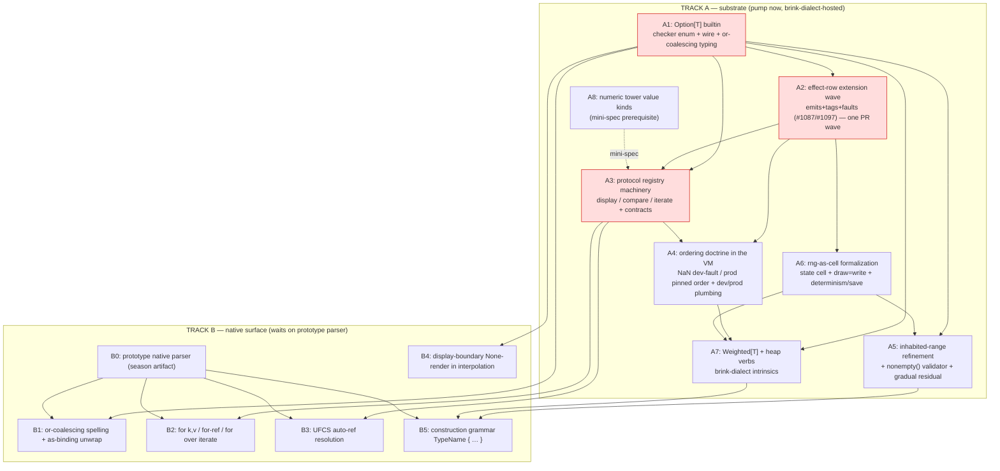

# Phase C — implementation sequencing (DRAFT)

Drafted 2026-07-19. The stdlib sitting's own closing note (§10) states
the split this document formalizes:

> the numeric tower, effect-row extensions #1087/#1097, and the
> Option/registry substrate are compiler/runtime work that can pump
> **before the parser exists**; the surface-syntax-dependent parts wait
> on the prototype parser.

The organizing axis is therefore **the native-surface parser
dependency**. Track A (substrate) can pump today against the **current
brink dialect** — the T1b/T1c extension surface that already parses
lowercase free functions, `#[…]`/`#{…}` collection sigils, `ref` mutators
through the RMW discipline, and `#@`-channel annotations. Track B (native
surface) waits on the prototype parser (the season's next artifact).

**Why the current brink dialect is the early host (load-bearing).** The
oracle/test-harness machinery (`brink-test-harness`, the 5,598-episode
ratchet, insta snapshots) already covers the brink dialect end-to-end. A
verb implemented as a brink-dialect intrinsic — `Option[T]`, the
heap verbs, `Weighted[T]`, the effect-row extensions — gets **oracle and
snapshot coverage the day it lands**, years before the native parser can
exercise it. Every Track A wave should ship its verbs/machinery gated to
the brink dialect (the T1b stdlib-slice-1 precedent: lowercase free
functions, author-shadowable with E035), so the semantics are proven on
the existing harness and the native parser later inherits *tested*
behavior rather than co-developing it.

---

## 1. Dependency graph

Reading the graph: **A1 (Option), A2 (effect rows), A3 (registry)** are
the three roots everything else hangs off — they are the critical path.
The dashed edge marks the tower mini-spec (⏳ §2b) as a prerequisite for
tabling/registering the tower's `display`/equality behavior (A8 can start
its value-kind work independently but its protocol rows wait on the
mini-spec and A3). Track B nodes all wait on **B0 (the parser)** *and*
their Track A substrate — B is never on the critical path for correctness,
only for surface ergonomics.

---

## 2. Track A — wave decomposition (pump-shaped, one reviewable PR each)

Sized to the repo's pump conventions (single reviewed, oracle-gated
PRs; spine slices serial, tails as pump waves — the T1b/FS-3 method).
Each wave is issue-shaped with an explicit scope and a green gate.

### Wave A1 — `Option[T]` as the third parameterized builtin
**Scope.** Compiler-owned enum type; checker-known polymorphic
signatures; wire form (V4 section, `none` + `some(T)`); the `Option[T] ≠
T` strictness everywhere except the display boundary; bare-`none`-needs-
context rule; the `or`-coalescing **typing** rule (`(Option[T],T)→T` and
`(Option[T],Option[T])→Option[T]` — F19). **Excludes** the surface
*spelling* of `or` and `as` (Track B). **Host dialect:** brink dialect —
`get`/`find`/`index_of` flips land here as intrinsics returning `Option`,
immediately oracle-covered. **Gate:** oracle byte-identical (Option is
new surface, vanilla-unreachable); snapshot the new verbs. **Blocks:**
A2, A3, A5, A7, B1, B4. **Findings owed first:** F19 (or typing).

### Wave A2 — effect-row extension: emits + tags + faults (#1087/#1097)
**Scope.** The three new row dimensions as **one PR wave** per the mini-
sitting note (#1087/#1097 explicitly "one row-extension PR wave"). New
atom kinds in the factored `EffectRows` (check the reserved-slot posture
from T2-3 before extending); per-SCC conservative-total inference;
`@[effects(…)]` assertion final form (subsets of {pure,silent,total},
exceedance-only) — **including the doc-sync** superseding `#@effects` in
effects-spec §10 and #1087. Ground-truth harness extension (#885 pattern:
instrumented VM asserts observed-output ⊆ declared-emits). **Host
dialect:** brink dialect (rows are dialect-independent; the harness runs
on existing corpus). **Gate:** the instrumented-VM witness + oracle
byte-identical (rows are metadata, no behavior change). **Depends:** A1
(faults row references Option-vs-fault boundary). **Blocks:** A3, A4, A6.

### Wave A3 — the protocol registry machinery
**Scope.** Closed registry of `display`/`compare`/`iterate`; per-protocol
**effect-contract enforcement** on impls (checker rejects a `display` that
isn't pure·silent·total — needs A2's rows); structural defaults for
enums/structs (`display`, and the pull-`next` for machine forms); the
iterate laws property-harness ("every element once; none terminal and
sticky"). **Excludes** the impl *spelling* (attribute vs impl-block, ⏳
code-dialect) and user-iterable participation in the trio (#1090-gated) —
v1 wires **`for` as the only iterate consumer**. **Host dialect:** brink
dialect (structs/enums already exist under TM-4). **Gate:** contract-
violation compile errors tested; iterate law harness green; oracle
byte-identical. **Depends:** A1, A2. **Blocks:** A4, B2, B3. **Findings
owed first:** F1 (does string() route through display), F6 (shadowing
protocol names) — both must be ruled before display's consumer set and
name-reservation are implementable.

### Wave A4 — the ordering doctrine + dev/prod plumbing
**Scope.** NaN → turn-terminating fault in dev / pinned non-fabricating
total order in prod, for `sort`/`sort_by`/`min`/`max`/`heap_push`; the
orderable-types roster (int/float/bool/string/array-lexicographic;
structs/enums via `compare`); mode-independent rows (`[float]` orderings
carry `faults` unconditionally — from A2); **dev/prod mode plumbing**
(the knob — project config + host override; knob *home* is the tooling
sitting ⏳, but the mode *mechanism* lands here); frozen IEEE operators
untouched. **Host dialect:** brink dialect (`sort`/`min`/`max` already
exist as slice-1-adjacent). **Gate:** dev-fault and prod-order both
snapshot-tested on `[float]` corpus; oracle byte-identical for
NaN-free/int/string data (the modes-agree property). **Depends:** A2
(faults row), A3 (compare protocol for struct ordering). **Blocks:** A7
(heap NaN-check). **Findings:** F14 (sort_by does not inherit `F:float`),
F15 (compare/equality coherence).

### Wave A5 — the inhabited-range refinement
**Scope.** The refinement type; literal-bounds free coercion (const-fold);
statically-empty literal = compile error; `(a..b).nonempty() →
Option[<inhabited range>]` validator; **the gradual-mode runtime residual
(F8)** — `rand::int` faults on empty in gradual, inert under strict;
recorded as the general refinement→gradual rule. **Depends:** A1 (Option
return of nonempty), A6 (rand::int is the consumer). **Blocks:** B5
(construction grammar for refined literals). **Findings owed first:** F7
(ranges as first-class values / FlowFrame wire — **must precede** this:
the refinement is a refined *view* over the range value kind, which F7
must first establish), F8 (gradual residual).

### Wave A6 — rng-as-cell formalization
**Scope.** RNG as a named runtime state cell owned by `std::rand`; every
draw an ordinary **write** in the def's row (no new dimension — reuses
A2's machinery); algorithm pinned; draws = pure fn of state→(value,
state'); state saves/loads with the story (it already lives in story
state); seeded replay identical; unseeded host-seed at start (manifest-
visible). Verbs `int`/`float`/`chance`/`pick`/`shuffle`/`shuffled`/`seed`.
**Host dialect:** brink dialect. **Gate:** seeded-replay determinism test
(identical transcript); save/load round-trip; oracle byte-identical (ink
`RANDOM`/`SEED_RANDOM` frozen over the same cell — verify no drift).
**Depends:** A2 (write-row for draws). **Blocks:** A5 (rand::int), A7
(roll). **Findings owed first:** F3 (chance(p) domain — blocks the chance
verb specifically; the rest of A6 can proceed without it), F4 (float name
disambiguation — trivial, resolve in-wave).

### Wave A7 — `Weighted[T]` + heap verbs
**Scope.** `Weighted[T]` parameterized builtin; `Weighted { weight:
value }` literal (**multiset** duplicate policy — F17); evidence-by-
construction refusal of empty/zero/negative (compile error where
classifiable, **NEW construction-fault diagnostic** for computed weights —
owed by Phase C); `roll(w) → T` (in `std::rand`); heap verbs over `[T]`
(`heap_push` NaN-check per A4, `heap_pop`/`heap_peek` → Option). **Host
dialect:** brink dialect intrinsics. **Gate:** construction-refusal errors
tested; heap-invariant property test; oracle byte-identical. **Depends:**
A1 (Option returns), A4 (heap NaN-check), A6 (roll writes rng). **Findings
owed first:** F17 (multiset duplicate policy), the NEW Weighted diagnostic
code.

### Wave A8 — numeric tower value kinds (gated on the mini-spec ⏳)
**Scope.** vec2/vec3/vec4/quat as compiler-known Value kinds; f32
components; wire/codecs/marshal legs; operator semantics (componentwise,
scale, mat*vec, quat*quat/vec); `dot`/`cross` verbs; tower-wide
min/max/clamp/lerp; NaN/equality composition; save posture. **Prerequisite:
the owed §2b mini-spec (F24)** — do not start the value-kind work until it
lands. **Host dialect:** brink dialect (structs+UFCS already exist; the
#827 decision may find structs+UFCS suffice — the mini-spec decides).
**Gate:** glam-alignment tests; wire round-trip; oracle byte-identical.
**Depends:** the mini-spec; A3 for the tower's `display`/equality protocol
rows. **Independent** of the Option/rand critical path otherwise.

---

## 3. Track B — parser-dependent surface (waits on B0)

These cannot pump until the prototype native parser (B0) exists; each
also depends on its Track A substrate being green so the surface lowers to
*tested* semantics.

### Wave B1 — `or`-coalescing spelling + `as`-binding unwrap (BUILT)
`x or default` surface (typing from A1); the `EXPR as NAME` Option-unwrap
in `if`/`while` (F16 — the primary consumer of every Option-returning
verb, `while heap_pop(ref h) as node`, `if m.get(k) as v`). **Depends:**
B0, A1.

**Landed in two slices.** B1 (#1460) shipped `x or default` as
`InfixOp::Coalesce` + `Opcode::Coalesce`, and honestly *declined* the
`as`-binding: its grammar existed only as illustrative sketches, in two
mutually inconsistent shapes. The reconciliation was ruled 2026-07-26
("The `as` binding: one construct, both condition positions, `{if}`
spelling") and built as **B1b (#1475)** — one grammar rule
(`AS_BINDING`) serving the statement condition position (`if`/`while`)
and the template one (`{if EXPR as NAME: … else: …}`), lowered to one
fused test-and-bind opcode (`Opcode::OptionBind`). Binding immutable
(**E148**), typed `T` from `Option[T]`, scoped strictly to the success
arm, rebinding per iteration in `while`; whole-condition-only for v1
(**E145** — let-chains stay additively available later); a non-Option
condition is **E147** (runtime residual:
`RuntimeError::AsBindingNotOption`). **Deliberately not implemented:**
`as` in a choice guard — ruled the same day
(capture-at-presentation, by value, serialized with the pending choice)
but sequenced with the `.inkb` v6 Choice record, so B1b diagnoses it as
not-yet-supported (**E146**) rather than half-lowering it.

### Wave B2 — `for k, v in m` / `for ref x in xs` / `for` over `iterate`
The two-binding map desugar (**F10** — exact lowering + snapshot-keys
mutation semantics **must be ruled first**); the 🔶 `for ref` mutating
iteration (index-desugar over RMW); `for` as the iterate-protocol
consumer. **Depends:** B0, A3 (iterate). **Findings owed first:** F10
(blocking).

### Wave B3 — UFCS auto-ref resolution
`inventory.push(sword)` auto-refs an lvalue receiver; rvalue-receiver-on-
mutating-verb compile error (`[1,2].push(3)`, `a.sorted().push(x)`);
field-path receivers write through RMW; field access beats UFCS on
resolution. **Depends:** B0, A3 (so completion reads registry + intrinsic
signatures). **Findings:** F0 (sort_by's ref-ness decides its rvalue-
receiver behavior — **must be ruled** so UFCS knows whether `a.sort_by(c)`
on an rvalue is an error).

**B3a — the resolution pass itself (SHIPPED, issue #1482).** The wave split
once the pass was designed (D1–D5 RULED 2026-07-26): `brink-analyzer::ufcs`
is the type-directed pass that decides `recv.name(args)` — field access wins
outright (`E140` when the matching field is not callable), else a free
function in ordinary lexical scope is desugared to `name(recv, args)`
(`E141` when neither, `E142` when the receiver's type is unknown), with the
verdict recorded in a `node → verdict` side table for LIR lowering and IDE
hover. **Auto-ref is explicitly not in it**: a free function with a `ref`
first parameter reached through method syntax is refused with `E143` rather
than desugared by value, and lifting that fence is the remaining B3 work
(issue #1462), built on top of the pass.

### Wave B4 — display-boundary None-render in interpolation (SHIPPED, issue #1463)
The §1.6b forgiveness: a final-None interpolation renders as nothing;
everywhere else `Option[T] ≠ T` strict; nested compositions never
forgiven; the traceability rider (transcript/debug records None-renders).
**Turned out not to depend on B0** — `{…}` interpolation and `Option[T]`
already exist on the current brink dialect (the same "early host" pattern
§0's opening note argues for), so the boundary shipped as a
`brink-runtime` value-display change (`value_ops::stringify_display`),
oracle- and brink-corpus-covered immediately, with no native-parser
surface involved at all; the graph above no longer draws a `B0 --> B4`
edge, reflecting that. **Findings:** F1 — RESOLVED, the boundary does **not** govern
`string()` (§1.6's own text: "`string()`'s ruled totality is preserved");
F12 — RESOLVED by inspection, `note_effect_emit` fires unconditionally in
`vm.rs` before the output push, independent of whether the pushed value
later resolves to empty text. **Deferred as named-edge riders (not
implemented here):** the always-None-interpolation lint; choice-text/tag
surfaces distinguishing an accidental empty choice/tag from a deliberate
`* []` (choice display text shares the fragment-resolution path this wave
touches, so it inherits the same forgiveness — whether that is the
intended edge behavior is still open).

### Wave B5 — construction grammar `TypeName { … }` (BUILT, #1464)
The one initializer grammar, per-type meaning: struct fields / map pairs /
flags members / `Weighted` multiset / enum-variant payloads / tower
components. **The protocol-vs-grammar question was #1103 — RULED
2026-07-23**: construction is **protocol dispatch**, the registry's 4th
entry (`construct`), not grammar dispatch over a closed set.

**Landed (#1464):** the native grammar (`CONSTRUCT_LITERAL` /
`CONSTRUCT_ENTRY` — one shape for the element and pair/field forms) plus
the registry (`brink_ir::hir::construct::ConstructTarget`, std-only:
`Map`/`Flags`/`Weighted`, with an unregistered name falling through to the
declared-struct reading). Duplicate map keys are a compile error (**E138**,
cascade ruling A); a form mismatch is **E139**. Enum-variant payloads and
tower components are not registered — enums have no HIR node yet
(`docs/b0-sequencing.md`), and the tower has its own NS-A8 call grammar.
**Deferred with the ruling:** user-type opt-in (the `impl` spelling), the
validating `construct → Option` member's spelling, and the spread form.
**Depends:** B0, A5 (refined-literal coercion at construction), A7
(Weighted). **Findings:** F17 (Weighted multiset), F5/duplicate policies.

---

## 4. Recommended pump order

**Critical path (serial spine, reviewed slices):**
`A1 → A2 → A3 → A4`, with `A6` joining after A2 (parallel to A3/A4). These
five are the substrate everything leans on and each changes checker/VM
core — spine treatment (single reviewed oracle-gated agents), not a
parallel pump.

**Parallel pump waves (after their deps are green):**
- `A5` (after A1+A6, and after **F7 is ruled**),
- `A7` (after A1+A4+A6),
- `A8` (after the mini-spec; otherwise independent — can run any time its
  prerequisite lands).

**Track B** opens only once B0 (the prototype parser) exists; within it,
`B1`/`B4` (Option ergonomics) first, then `B2`/`B3` (iteration/UFCS,
needing A3), then `B5` (construction).

**Blocking-finding gates before code.** Per CLAUDE.md's compiler workflow
("do not implement before plan mode; write failing tests first"), the
seven blocking findings (F0, F1, F3, F6, F7, F8, F10) must be **ruled**
before their waves can honestly begin:

| Wave | Blocked on ruling |
|---|---|
| A3 | F1 (string↔display), F6 (shadow protocol names) |
| A5 | F7 (range value kind), F8 (gradual residual) |
| A6 (chance verb only) | F3 (chance domain) |
| A7 | F17 policy + NEW Weighted diagnostic (non-blocking but owed) |
| B2 | F10 (for-k-v lowering) |
| B3 | F0 (sort_by ref-ness) |

F0 also silently gates A4 to the extent `sort_by`'s signature is part of
the ordering-verb set — resolve F0 early (it is cheap: pick a signature)
so A4 and B3 both proceed cleanly.

---

## 5. What lands where — the brink-dialect hosting map

| Verb family | Early host (brink dialect, oracle-covered now) | Native-surface addition later |
|---|---|---|
| Option flips (`get`/`find`/`index_of`/`min`/`max`/`first`/`last`/`pop`) | A1 intrinsics, returning `Option` | `or`/`as` ergonomics (B1) |
| effect rows | A2 (dialect-independent metadata) | assertion spelling already `@[effects]` |
| protocols | A3 structural defaults; `for` consumer | impl spelling (⏳), UFCS completion (B3) |
| ordering | A4 `sort`/`min`/`max` intrinsics | — |
| rand | A6 intrinsics | — (namespaced, no surface sugar) |
| Weighted/heap | A7 intrinsics | construction grammar (B5) |
| tower | A8 value kinds + `dot`/`cross` | construction grammar (B5), `#827` may fold to structs+UFCS |
| maps `for k,v` | (lowering) | B2 (waits on parser + F10) |

The principle throughout: **semantics land on Track A against the tested
brink dialect; the native surface adds only spelling.** When B0 arrives,
the parser lowers to HIR that Track A already proved — the native surface
inherits correctness instead of co-developing it, and the oracle guards
both surfaces the whole way.
